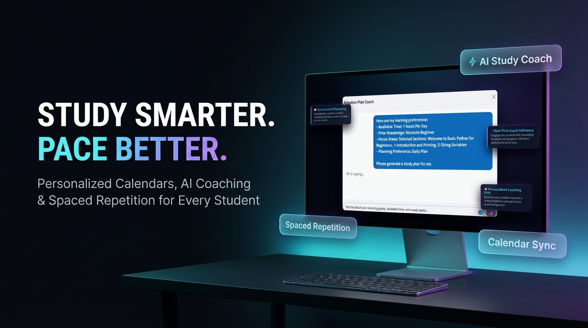

# Moodle Plugins — Style 6 Promo Banner Catalog & Rollout Plan

We have standardized on **Style 6 — The 70/30 Apple-Style Callout Hero** as our universal promotional banner design across all Moodle plugins. Below is the progress, completed banners, and the prepared prompt specifications for the remaining plugins.

---

## ✅ Completed Banners (Style 6 Gold Standard)

### 1. Smart Dashboard (`smartdashboard`)
- **Headline:** `ONE DASHBOARD. EVERY ROLE.`
- **Subtitle:** *Personalized Analytics, Reports & Insights for Every Moodle Role*
- **Callout Badges:** `At-Risk Alerts`, `AI Insights`, `Role-Based Dashboards`
- **File Saved At:** `SAMPLES/banner_smartdashboard_final.jpg`

---

### 2. Adaptive Study Plan (`adaptiveplan`)
- **Headline:** `STUDY SMARTER. PACE BETTER.`
- **Subtitle:** *Personalized Calendars, AI Coaching & Spaced Repetition for Every Student*
- **Callout Badges:** `AI Study Coach`, `Spaced Repetition`, `Calendar Sync`
- **File Saved At:** `improved/adaptiveplan/promo_banner_style6.jpg`

---

## ⏳ Prepared Banner Specifications (Ready for Generation upon Quota Reset)

Due to reaching the temporary image generation quota limit (`429 Too Many Requests`), the remaining 8 plugin banners are queued with exact Style 6 specifications:

| Plugin Name | Headline | Subtitle | 3 Callout Badges | Reference Screenshot |
|---|---|---|---|---|
| **AI Rubric Generator** (`airubricgenerator`) | `FLAWLESS RUBRICS. ZERO GRUNT WORK.` | *AI-Powered Rubric Generation, Bloom's Taxonomy & Interactive Refinement* | `Bloom's & SOLO Taxonomy` `Interactive AI Chat` `Pre-Pilot Testing` | `airubricgenerator/4 rubric preview -1.png` |
| **Smart Catalog** (`cataloge`) | `THE CATALOG MOODLE DESERVES.` | *Modern Course Discovery, Program Bundles & Instant Filtering for Learners* | `Program Bundles` `Instant Course Filtering` `Instructor Discovery` | `cataloge/program.png` |
| **Chat with Assignment AI** (`chatwithassignment`) | `FEEDBACK INTO CONVERSATION.` | *Interactive Socratic AI Tutoring Inside Every Moodle Assignment* | `Socratic AI Tutor` `24/7 Rubric Clarity` `Teacher-Customized Persona` | `chatwithassignment/chat 1.png` |
| **Gap Close** (`gapcloser`) | `CLOSE EVERY KNOWLEDGE GAP.` | *Automated Remedial Review & Mistake Mastery Across All Moodle Quizzes* | `Auto-Mistake Aggregator` `Interactive Formative Quiz` `Zero Gradebook Overhead` | `gapcloser/2 gap closer quiz.png` |
| **Moodle Quiz AI Chat** (`qai`) | `QUIZ REVIEWS INTO CONVERSATION.` | *Interactive Per-Question AI Tutoring & BYOK Economics for Moodle Quizzes* | `Ask AI to Explain` `5-Level Context Control` `BYOK Token Economics` | `qai/1  chat with question.png` |
| **Smart Grade AI** (`smartgradeai`) | `GRADING IN SECONDS. CONTROL FOREVER.` | *Human-in-the-Loop AI Grading, Rubric Intelligence & Automatic Fallback Protection* | `Human-in-the-Loop Review` `Formative Student Feedback` `Auto-Provider Fallback` | `smartgradeai/5 - grade waiting teacher review.png` |
| **Smart Course Page** (`smartcoursepage`) | `COURSES THAT ENGAGE AT FIRST SIGHT.` | *Interactive Visual Syllabus, Instructor Bios & Student Review Highlights* | `Visual Course Outline` `Instructor Bio & Reviews` `Instant Learning Stats` | `smartcoursepage/2- course info - what will student learn.png` |
| **Case Study Question Type** (`case study`) | `ONE SCENARIO. ENDLESS QUESTIONS.` | *Enterprise Clinical & Scenario-Based Container Question Type for Moodle* | `Stacked Carousel Mode` `Split-View Exam Layout` `Zero Shuffle Desync` | `case study/3  subq select.png` |

---

### How to Resume
As soon as your image generation quota resets, simply tell me to **"resume generating the remaining 8 banners"** and we will execute the remaining batch of Style 6 promo banners immediately!
