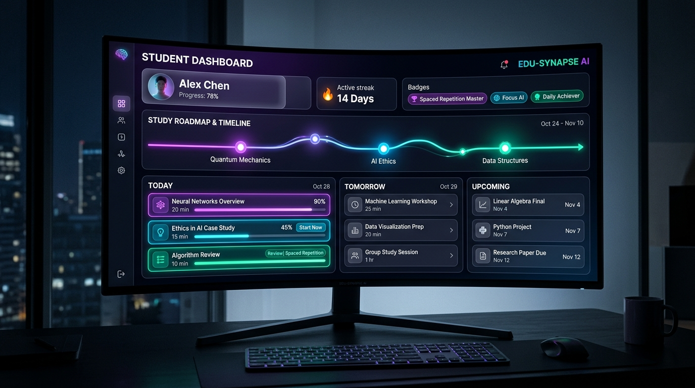
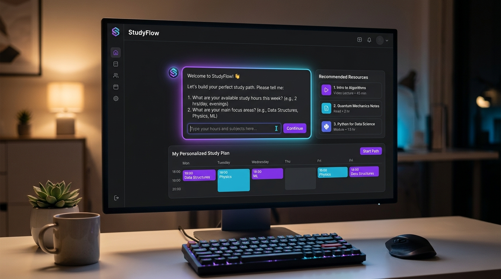
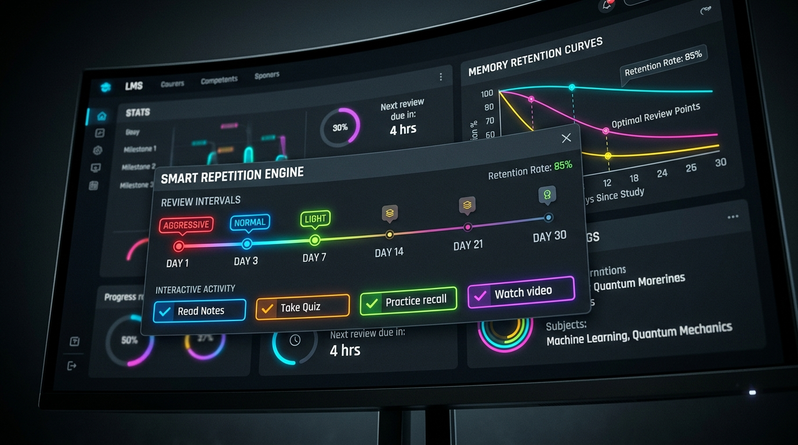

<p align="center">
  
</p>

<p align="center">
  <a href="https://moodle.org/plugins"></a>
  <a href="https://www.gnu.org/licenses/gpl-3.0"></a>
  <a href="#"></a>
  <a href="#"></a>
  <a href="#"></a>
  <a href="#"></a>
</p>

<p align="center">
  <strong>Turn Passive Course Navigation Into an AI-Driven, Adaptive Learning Journey.</strong><br>
  An intelligent, calendar-integrated Moodle activity module (<code>mod_adaptiveplan</code>) featuring <b>AI-Powered Schedule Generation</b>, <b>Conversational Study Coaching</b>, <b>Automated Spaced Repetition</b>, and <b>Smart Activity Duration Detection</b>.
</p>

---

## 🌟 Why Adaptive Study Plan?

Traditional LMS courses present students with long lists of static links, leaving them to guess what to study, how long it will take, and how to pace themselves before exams. Procrastination and cognitive overload are the leading causes of student dropouts.

**Adaptive Study Plan (`mod_adaptiveplan`) transforms how students learn:**

* **For Students:** Stop guessing and start progressing. Interact with an **AI Study Coach**, set your weekly availability and focus areas, and receive a personalized, calendar-integrated roadmap that automatically adapts to your busy life.
* **For Teachers & Instructional Designers:** Eliminate manual scheduling and micromanagement. Simply tag your course activities with durations `(15:41)` or spaced repetition intensities (`#Repetition=Aggressive#`), and let the AI generate customized study paths for every individual student.
* **For LMS Administrators & Institutions:** Drive course completion rates and long-term retention without external database bloat. Natively integrated with **Moodle Core AI** (`\core_ai\manager`) and fully compatible with **`local_aihub`**.

---

## 🎬 Interface Screenshots & Visual Showcase

### 1. Hero Overview — Student AI Roadmap Dashboard
<p align="center">
  
</p>

* **Primary Interface:** The dark-mode glassmorphism dashboard displays the student's personalized study roadmap, completion streak counter, visual progress bars, and tasks organized chronologically (**Today**, **Tomorrow**, **Upcoming**).

### 2. Conversational AI Study Coach & Smart Onboarding
<p align="center">
  
</p>

* **Conversational Onboarding:** Students interact with an AI study coach to define their weekly study availability and target focus areas, dynamically updating the recommended study path in real time.

### 3. Automated Spaced Repetition & Retention Hub
<p align="center">
  
</p>

* **Spaced Repetition Review Timeline:** The built-in memory retention engine schedules review sessions across **Day 1**, **Day 3**, and **Day 7** intervals, with visual tags indicating repetition intensity (**Aggressive**, **Normal**, **Light**).

---

## ✨ Comprehensive Features

<table>
<tr>
<td width="50%" valign="top">

### 🤖 AI-Powered Schedule Generation
- **Conversational Onboarding Coach:** Interactive AI chat modal guides students to specify available hours, study frequency, prior knowledge, and exam dates.
- **Dynamic Plan Creation:** Generates structured study plans categorized into **Today**, **Tomorrow**, and **Upcoming** study blocks.
- **Smart Workload Balancing:** Automatically prevents burnout by distributing study hours evenly across available days.

</td>
<td width="50%" valign="top">

### 🧠 Built-In Spaced Repetition Engine
- **Automated Review Scheduling:** Seamlessly weaves review sessions for previously studied activities into future plan dates.
- **Granular Intensity Control:** Teachers can define `#Repetition=Aggressive#`, `Normal`, `Light`, or `None` on any activity.
- **Zero Database Bloat:** Spaced review items (`[Review] Chapter 1`) are intelligently orchestrated by AI prompt engineering without extra DB overhead.

</td>
</tr>
<tr>
<td width="50%" valign="top">

### ⏱️ Smart Activity Duration Scanner
- **5 Intelligent Parsing Methods:** Automatically detects time requirements from titles, descriptions, Moodle tags, and custom fields.
- **Quiz Time-Limit Sync:** Automatically reads standard Moodle Quiz duration limits without manual tagging.
- **Page Count Estimation:** Converts reading assignments (`Pages: 10`) into accurate study minutes.

</td>
<td width="50%" valign="top">

### 🎯 Selective Focus & Customization
- **Modular Topic Focus:** Students can choose to generate a plan for **All Course Content** or target specific sections/modules they need help with.
- **Chat Toggle Control:** Teachers can enable or disable the conversational AI coach input via instance settings (`allowchat`).
- **One-Click Plan Reset:** Students can reset and rebuild their entire study schedule whenever their availability changes.

</td>
</tr>
<tr>
<td width="50%" valign="top">

### 🔗 Direct Activity Hyperlinks
- **Live Course Mapping:** Every study item title automatically matches against course modules and turns into a clickable hyperlink.
- **New Tab Launching:** Students click an item in their roadmap and jump directly to the Moodle Quiz, Page, Assignment, or Forum.

</td>
<td width="50%" valign="top">

### ⚡ Auto-Completion Sync
- **Real-Time Moodle Status Sync:** Automatically checks off study plan items when a student completes the activity in Moodle.
- **Supports All Assessments:** Syncs completion states for Quizzes, Assignments, Forums, Workshops, and SCORM packages.

</td>
</tr>
</table>

---

## 🧠 Spaced Repetition Engine in Depth

The built-in **Spaced Repetition Engine** applies cognitive science directly to your Moodle course. Instead of traditional flashcards, `mod_adaptiveplan` schedules full activity re-reviews at increasing intervals:

```
[Day 1: Learn Chapter 1] ──> [Day 3: Review Chapter 1] ──> [Day 7: Review Chapter 1] ──> [Day 14: Final Mastery]
```

### Controlling Repetition Intensity

By default, activities are assigned **Normal** repetition. Teachers can customize repetition intensity using two simple methods:

#### 1. In Activity Description / Intro Text
Add hashtag tags anywhere in the description of any Moodle activity (Page, Quiz, File, Assignment):
* `#Repetition=Aggressive#` ➡️ *Schedules 3 review sessions: Day 1, Day 3, and Day 7 after initial study.*
* `#Repetition=Normal#` ➡️ *Schedules 2 review sessions: Day 2 and Day 5 after initial study.*
* `#Repetition=Light#` ➡️ *Schedules 1 review session: Day 4 after initial study.*
* `#Repetition=None#` ➡️ *Disables spaced repetition completely (ideal for syllabi, introductions, or administrative forms).*

#### 2. Using Moodle Activity Custom Fields
Create a Moodle Activity Custom Field (Dropdown) with the shortname `repetition` and populate it with `Aggressive`, `Normal`, `Light`, and `None`. Teachers can then select the repetition intensity from a dropdown when editing any activity.

---

## ⏱️ How to Specify Activity Durations (Estimated Time)

The plugin scanner utilizes a smart 5-tier fallback hierarchy to detect the estimated completion time for every course activity:

### 1. In the Activity Name
The scanner automatically extracts duration from the activity title:
* **`Title (MM:SS)`** ➡️ *Example: `Intro to Physics Video (15:41)` (Automatically rounds 15:41 up to 16 min).*
* **`Title (X min)`** ➡️ *Example: `Reading Material (20 min)`.*

### 2. In the Activity Description / Intro Text
Place any of the following patterns anywhere in the activity intro text:
* **`Duration (MM:SS)`** ➡️ *Example: `Duration (15:41)`*
* **`Time: X min`** ➡️ *Example: `Time: 15 min`*
* **`Estimated Time: X`** ➡️ *Example: `Estimated Time: 20`*
* **`#Estimated Time=X#`** ➡️ *Example: `#Estimated Time=45#`*
* **`Pages: X`** ➡️ *Example: `Pages: 10`* (Automatically calculates reading duration based on page count).

### 3. Using Moodle Tags
Add tags to any Moodle activity following these formats:
* Tag: `Estimated Time: 15`
* Tag: `#Estimated Time=15#`

### 4. Automatic Moodle Settings & Custom Fields
* **Quizzes:** Automatically synchronizes with the standard Moodle Quiz **Time limit** setting. Zero manual tagging required!
* **Custom Fields:** Maps automatically to any site-wide or course activity custom field with the shortname `estimated_time`.

---

## 🚀 Setup and Workflow Guide

### Step 1: Install the Plugin
1. Download or clone `mod_adaptiveplan` into your Moodle `/mod/adaptiveplan` directory.
2. Log in as an Administrator and visit **Site administration → Notifications** to complete the installation.

### Step 2: Configure AI Providers
1. Ensure Moodle Core AI (`\core_ai\manager`) is enabled under **Site administration → AI → AI providers**, OR have **AI Hub (`local_aihub`)** installed and configured.
2. Verify that your AI provider supports JSON structured schema outputs (e.g., OpenAI GPT-4o / Gemini 1.5+).

### Step 3: Add to a Course
1. Turn on **Edit mode** in your Moodle course.
2. Click **Add an activity or resource** and select **Adaptive Study Plan**.
3. Configure instance settings:
   * **Name:** e.g., *My Personalized AI Study Plan*
   * **Prompt Instructions:** Add any custom course-specific rules for the AI Coach.
   * **Allow Chat:** Check to enable conversational AI onboarding.
4. Click **Save and display**.

### Step 4: Student Experience
1. When a student opens the activity, they interact with the **AI Coach** to input their schedule and goals.
2. The AI generates their interactive roadmap, linking every task directly to course activities.
3. As the student completes activities in Moodle, checkboxes automatically sync and update their progress.

---

## 🛠️ Technical Architecture & API

### Database Schema
* `adaptiveplan`: Stores activity instance settings (`course`, `name`, `intro`, `allowchat`, `prompt_instruction`).
* `adaptiveplan_items`: Tracks individual plan milestones and scheduled study days (`userid`, `title`, `due_date`, `status`).
* `adaptiveplan_item_activities`: Tracks activity-level tasks within plan items (`activityname`, `estimated_time`, `status`).
* `adaptiveplan_chat_messages`: Persists student AI conversation history (`message_type`, `message_content`).

### Core AJAX Action Endpoints (`ajax.php`)
* `generate_plan_from_chat`: Orchestrates course metadata scanning, prompt compilation, and AI JSON plan generation.
* `chat_submit`: Handles interactive student messages and returns AI Coach responses.
* `chat_history`: Retrieves existing conversation transcripts for the student.
* `reset_plan`: Deletes existing plan items and chat logs for a clean restart.

### AMD Javascript Architecture
All frontend interactivity is built using Moodle AMD modules (`amd/src/chat.js`).
> **Important for Developers:** Whenever you modify `amd/src/chat.js`, you must synchronize the production minified bundle:
> ```bash
> cp amd/src/chat.js amd/build/chat.min.js
> ```

---

## 📋 Requirements

| Requirement | Supported Version |
|---|---|
| **Moodle Core** | 4.0, 4.1, 4.2, 4.3, 4.4, 4.5, 5.0+ (`requires = 2022041900`) |
| **PHP** | 7.4, 8.0, 8.1, 8.2, 8.3+ |
| **AI Provider** | Moodle Core AI (`\core_ai\manager`) OR `local_aihub` |
| **Browser** | Modern desktop and mobile browsers (CSS Glassmorphism & Grid support) |

---

## 🗂️ Plugin Directory Structure

```
moodle_mod_adaptiveplan/
├── ajax.php                       # AJAX endpoint handler for plan generation & AI chat
├── amd/
│   ├── src/chat.js                # Frontend conversational AI & dashboard interactive logic
│   └── build/chat.min.js          # Compiled AMD bundle
├── classes/
│   ├── ai_manager.php             # AI provider abstraction & JSON schema validator
│   └── course_scanner.php         # 5-tier duration & repetition metadata scanner
├── db/
│   ├── access.php                 # Capability definitions
│   ├── install.xml                # Database schema (4 core tables)
│   └── upgrade.php                # Database migration scripts
├── lang/
│   └── en/adaptiveplan.php        # English language pack strings
├── templates/
│   ├── main_dashboard.mustache    # Responsive Student Roadmap dashboard template
│   └── plan_item.mustache         # Clickable activity item & badge template
├── .github/
│   └── screenshots/               # High-res reference images
├── index.php                      # Course activities overview page
├── view.php                       # Activity dashboard controller & completion syncer
├── styles.css                     # Premium dark-mode glassmorphism & responsive styles
└── version.php                    # Plugin version (2026012817 / v0.1.0 Alpha)
```

---

## 🤝 Contributing

We welcome community pull requests and feature enhancements!
1. **Fork** the repository.
2. Create your **Feature Branch** (`git checkout -b feature/amazing-feature`).
3. **Commit** your changes (`git commit -m 'Add amazing feature'`).
4. **Push** to your branch (`git push origin feature/amazing-feature`).
5. Open a **Pull Request**.

---

## 📄 License & Credits

Licensed under the [GNU General Public License v3.0](https://www.gnu.org/licenses/gpl-3.0.html).

<p align="center">
  Made with ❤️ by <a href="https://smartlearn.education"><strong>SmartLearn Education</strong></a><br>
  <em>Transforming Moodle from a learning platform into an AI-driven educational journey.</em>
</p>
