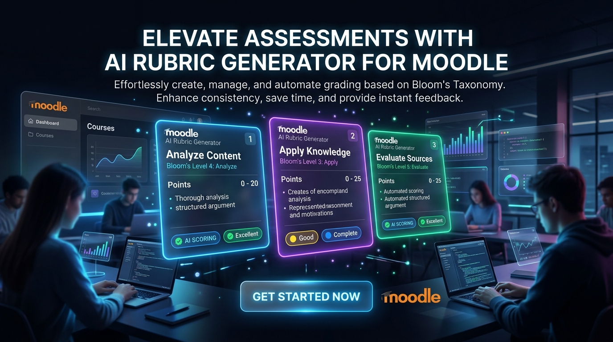

<p align="center">
  
</p>

<p align="center">
  <a href="https://moodle.org/plugins"></a>
  <a href="https://www.gnu.org/licenses/gpl-3.0"></a>
  <a href="#"></a>
  <a href="#"></a>
  <a href="#"></a>
</p>

<p align="center">
  <strong>Supercharge Your Moodle Assessment Workflow with Intelligent Rubric Generation, Interactive Natural Language Refinement, Pre-Pilot Submission Testing, and Course-Aware Assignment Description Creation.</strong><br>
  A state-of-the-art Moodle local plugin (<code>local_rubricgenerator</code>) that leverages Moodle's native Core AI subsystem to craft rigorous, pedagogically aligned grading rubrics and assignment specifications in seconds.
</p>

---

## 🌟 Why AI Rubric Generator?

Designing comprehensive, fair, and objective grading rubrics is one of the most intellectually demanding and time-consuming tasks for educators. Standard AI tools often produce generic checklists that ignore course context, lack pedagogical rigor, or fail to integrate cleanly with Moodle's native grading system.

**AI Rubric Generator (`local_rubricgenerator`) transforms how rubrics and assignment descriptions are built in Moodle:**

*   **For Teachers & Instructors:** Create production-ready, multi-level grading rubrics directly inside any Moodle assignment in seconds. Aligned with established pedagogical taxonomies (**Bloom's Taxonomy**, **SOLO Taxonomy**, and **Constructive Alignment**), the generator adapts to your exact assignment prompt, tone preferences, and grading scale.
*   **Interactive Refinement & Pre-Pilot Testing:** Don't just generate—**test-drive** your rubric before assigning it to students. Upload sample student submissions (PDF or plain text) to pilot-test how the AI evaluates and scores the work against your draft criteria. Refine criteria effortlessly using natural language prompts (e.g., *"Make the scoring stricter for citations"* or *"Add a criterion for critical analysis"*).
*   **Course-Aware Assignment Description Generator (v0.4.0):** Build rich, structured assignment instructions tailored to your course structure. Whether designing a final capstone project covering the entire course or a midterm assignment focused on selected chapters, the generator synthesizes your course content into clear learning objectives and student deliverables.
*   **For Administrators & Enterprise Systems:** Built natively on Moodle 4.5+ **Core AI (`core_ai`)**, ensuring seamless compatibility with OpenAI, Google Gemini, Azure OpenAI, or any configured Moodle AI provider without vendor lock-in or custom API integrations.

---

## 🎬 Visual Showcase

### 1. Context-Aware AI Rubric Generation & Framework Alignment
<p align="center">
  
</p>

*   **Intelligent Taxonomy Mapping:** Automatically structures grading criteria across pedagogical levels (e.g., *Remember, Understand, Apply, Analyze, Evaluate, Create* for Bloom's Taxonomy).
*   **Customizable Scales & Tones:** Choose the exact number of criteria, achievement levels, and tone (*Academic, Professional, Encouraging, Direct*) to match your institution's standards.

### 2. Pre-Pilot Rubric Testing & Student Submission Analyzer
<p align="center">
  
</p>

*   **Test-Drive Before You Assign:** Upload sample student PDF essays or paste text submissions to see instant predicted grades and criterion-by-criterion level matching.
*   **Interactive Natural Language Refinement:** Fine-tune draft rubrics conversationally by typing instructions directly into the refinement box before publishing to the assignment grading methods.

### 3. Course-Aware Assignment Description Generator
<p align="center">
  
</p>

*   **Course Context Integration:** Analyzes course sections, topics, and activities to generate contextually relevant assignment prompts.
*   **Flexible Scope & Templates:** Choose between **Full Course** mode (for final projects) or **Selected Sections** mode (for chapter assessments), with pre-built templates for *Research Papers, Case Studies, Presentations, Group Projects, and Practical Exercises*.

---

## 🚀 Key Features

| Feature | Description |
| :--- | :--- |
| **Moodle Core AI Native Architecture** | Seamlessly connects to any text generation provider configured in Moodle 4.5+'s `core_ai` subsystem (OpenAI, Google Gemini, Azure OpenAI, etc.). |
| **Pedagogical Framework Alignment** | Generates criteria aligned with **Bloom's Taxonomy**, **SOLO Taxonomy**, or **Constructive Alignment** for rigorous academic standards. |
| **Interactive Natural Language Refinement** | Refine generated criteria, descriptions, and point allocations iteratively using natural language prompts without starting from scratch. |
| **Pre-Pilot Submission Testing** | Built-in client-side PDF text extraction (`pdf.js`) and text parser lets educators test their draft rubric against sample submissions before publishing. |
| **Course-Aware Description Generator** | Dynamically builds assignment prompts and instructions based on course structure, supporting both Full Course and Selected Sections modes. |
| **8 Professional Assignment Templates** | Includes ready-to-use templates for *Final Project, Midterm, Chapter Assignment, Practical Exercise, Research Paper, Presentation, Group Project, and Case Study*. |
| **One-Click Grading Method Deployment** | Instantly saves generated rubrics directly into Moodle's native Advanced Grading rubric tables (`grading_form_rubric`). |
| **Word (.docx) & PDF Export** | Export generated rubrics to Microsoft Word (.docx) or PDF for offline faculty review, syllabus documentation, or department archives. |
| **Enterprise Security & Compliance** | Strict JSON schema validation, input sanitization, database query optimization, and full compliance with Moodle Marketplace coding standards. |

---

## 🏗 Architecture & Workflow

```
+------------------------------------+
|     Moodle Assignment Activity     |
+------------------------------------+
                  |
        (Choose AI Generator)
                  |
        +---------+---------+
        |                   |
        v                   v
+---------------+   +----------------------------------+
| Generate      |   | Course-Aware Description         |
| AI Rubric     |   | Generator (v0.4.0)               |
+---------------+   +----------------------------------+
        |                   |
        +---------+---------+
                  |
                  v
+------------------------------------+
|  Moodle 4.5 Core AI Subsystem      |
|  (OpenAI / Gemini / Azure OpenAI)  |
+------------------------------------+
                  |
                  v
+------------------------------------+
|  Interactive Review & Refinement   |
|  * Natural Language Adjustments    |
|  * Pre-Pilot Testing (PDF/Text)    |
+------------------------------------+
                  |
        +---------+---------+
        |                   |
   [ Save Rubric ]     [ Apply Description ]
        |                   |
        v                   v
+---------------+   +----------------------------------+
| Moodle Native |   | Assignment Intro & Deliverables  |
| Grading Table |   | Updated Automatically            |
+---------------+   +----------------------------------+
```

---

## 📦 Installation

### Prerequisites
*   **Moodle 4.5** or later (Required for the `core_ai` subsystem).
*   An active, enabled AI provider in **Site administration > Plugins > AI > AI providers** (e.g., OpenAI API, Google Gemini API, or Azure OpenAI).

### Step-by-Step Installation

1.  **Clone or Download the Repository:**
    Clone this repository into your Moodle site's `local/` directory:
    ```bash
    cd /path/to/moodle/local
    git clone https://github.com/Smartlearn-edu/moodle_local_airubricgenerator rubricgenerator
    ```

2.  **Run Moodle Upgrade:**
    *   Log in to your Moodle site as an Administrator.
    *   Navigate to **Site administration > Notifications** (or visit `/admin/index.php`).
    *   Follow the on-screen prompts to upgrade your database and install the plugin.

3.  **Configure Plugin Settings:**
    *   Go to **Site administration > Plugins > Local plugins > AI Rubric Generator**.
    *   Confirm your AI generation defaults (default criterion count, default framework, and tone preferences).

---

## 📖 Usage Guide

### 1. Generating & Refining a Rubric

1.  Open an **Assignment** activity in your course.
2.  In the assignment navigation tab or **More** dropdown menu, select **Generate Rubric with AI**.
3.  Choose your generation parameters:
    *   **Number of Criteria:** (e.g., 4 to 8 criteria).
    *   **Number of Levels:** (e.g., 3 to 5 grading levels per criterion).
    *   **Pedagogical Framework:** Bloom's Taxonomy, SOLO Taxonomy, or General.
    *   **Tone:** Academic, Professional, Encouraging, or Direct.
4.  Click **Generate Rubric**.
5.  In the interactive review screen, you can:
    *   **Refine:** Type changes in the prompt box (e.g., *"Make the 4th criterion focus on APA referencing"*) and click **Refine Rubric**.
    *   **Test Drive:** Switch to the **Test Your Rubric** tab, upload a sample student PDF submission, and watch the AI grade the submission against your draft criteria in real time.
    *   **Export:** Download as Word (.docx) or PDF for offline sharing.
    *   **Save:** Click **Save as Assignment Rubric** to publish it to your Moodle grading methods.

### 2. Generating a Course-Aware Assignment Description

1.  Open an **Assignment** activity in your course.
2.  In the assignment navigation tab or **More** dropdown menu, select **Generate Description with AI**.
3.  Select your **Generation Mode**:
    *   **Full Course:** Synthesizes objectives across all sections for final capstone projects.
    *   **Selected Sections:** Check specific course sections to include for midterms or topic assignments.
4.  Choose an **Assignment Type Template** (Final Project, Research Paper, Practical Exercise, Case Study, etc.).
5.  Set additional options such as target tone and special submission instructions.
6.  Click **Generate Description**.
7.  Review the output and click **Apply to Assignment** to automatically update the assignment's description field.

---

## ⚙️ Configuration & Requirements

*   **Client-Side PDF Processing:** The "Test Your Rubric" feature uses modern HTML5 and JavaScript client-side PDF text extraction (`pdf.js`). Ensure users have JavaScript enabled.
*   **Token Consumption:** Generating and refining rubrics consumes tokens from your configured AI provider in Moodle Core AI.
*   **Database Compatibility:** Fully tested with MySQL 8.0+, MariaDB 10.6+, and PostgreSQL 13+.

---

## 🛡️ Security & Privacy

*   **Strict Payload Validation:** All JSON responses from AI models are validated against strict JSON schemas before parsing.
*   **HTML Input Sanitization:** All user-facing text and descriptions are sanitized using Moodle's `format_text()` and `clean_param()` security APIs.
*   **Privacy API Compliant:** Fully supports Moodle's Privacy API (`privacy\provider`) for data export and deletion requests.

---

## 📄 License & Copyright

*   **License:** GNU General Public License v3.0 or later ([GPL-3.0-or-later](https://www.gnu.org/copyleft/gpl.html))
*   **Copyright:** Copyright (C) 2026 Mohammad Nabil
*   **Bug Tracker:** [GitHub Issues](https://github.com/Smartlearn-edu/moodle_local_airubricgenerator/issues)
*   **Repository:** [moodle_local_airubricgenerator](https://github.com/Smartlearn-edu/moodle_local_airubricgenerator)
