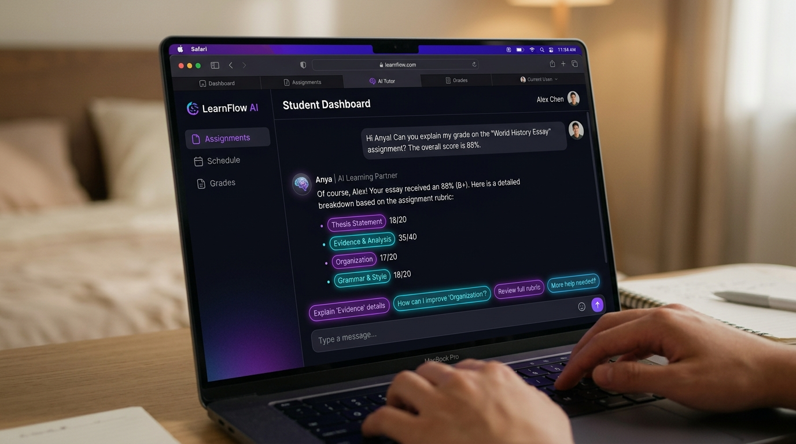
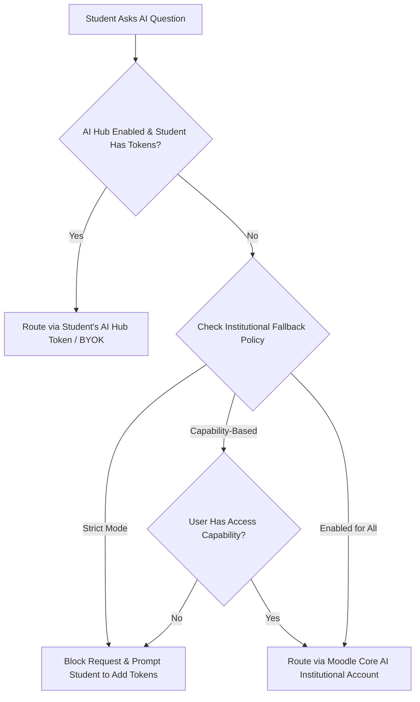

<p align="center">
  
</p>

<p align="center">
  <a href="https://moodle.org/plugins"></a>
  <a href="https://www.gnu.org/licenses/gpl-3.0"></a>
  <a href="#"></a>
  <a href="#"></a>
  <a href="#"></a>
</p>

<p align="center">
  <strong>Transform Assignment Feedback from a One-Way Dead End into an Interactive AI Learning Conversation.</strong><br>
  An innovative Moodle local plugin that integrates an intelligent, personalized AI tutor directly into the assignment grading interface using the <b>Moodle Core AI Subsystem</b> & <b>AI Hub</b>.
</p>

---

## 🌟 Why Chat with Assignment AI?

Traditional assignment feedback suffers from a critical flaw: students rarely read it, and when they do, they often don't understand *why* points were deducted or *how* to improve. 

**Chat with Assignment AI changes the paradigm.**
Instead of passively reading feedback (or ignoring it completely), **students enter an active, Socratic dialogue about their submission.**

* **For Students:** Get instant, 24/7 clarification on rubric scores, teacher comments, and specific submission details without waiting for office hours. Ask follow-up questions like *"Why did I lose points on the argument structure?"* or *"Can you give an example of how to strengthen my thesis?"*
* **For Teachers & Instructors:** Turn grading feedback into a living tutoring session. Customize the AI's persona and pedagogical instructions per assignment, ensuring the AI acts as a supportive coach that guides rather than just giving away answers.
* **For Administrators:** Maintain complete budgetary and data control. Leverage granular **5-Level Context Routing**, intelligent token savings (injecting context only on the first turn), and seamless **AI Hub (BYOK)** integration so students can fund their own tutoring tokens.

---

## 🎬 Interface & Visual Showcase

### 1. Hero Overview & Interactive Chat Interface
<p align="center">
  
</p>

* **Seamless Assignment Integration:** The interactive AI Tutor chat pane opens directly alongside the student's submission and teacher feedback.
* **Rubric-Grounded Responses:** The tutor answers questions using the exact grading criteria, points scored, and teacher comments from `mod_assign`.

### 2. Precision Rubric Breakdown & Interactive Prompts
<p align="center">
  
</p>

* **Quick-Action Socratic Buttons:** Pre-configured prompt buttons (*"Explain 'Evidence' details"*, *"How can I improve 'Organization'?"*, *"Review full rubric"*) encourage active reflection.
* **Granular Score Explanation:** Helps students understand exactly why points were deducted and how to achieve full marks on future submissions.

### 3. Admin AI Provider Routing & Context Levels Dashboard
<p align="center">
  
</p>

* **Complete Budget & Token Visibility:** Track real-time token spend, latency, and cost reduction across AI models.
* **Granular Context Level Control:** Configure levels 1 through 5 per assignment or site-wide to balance pedagogical depth with API consumption.

---

## ✨ Comprehensive Features

<table>
<tr>
<td width="50%" valign="top">

### 🗣️ Interactive Grade Discussions
- **Real-Time Socratic Dialogue:** Students converse directly with an AI tutor grounded in their actual grading data.
- **Rubric-Aware Reasoning:** Explains exact criterion deductions and teacher comments with actionable next steps.
- **One-Click Prompts:** Pre-configured Socratic prompt buttons (*"Explain my rubric scores"*, *"How can I improve?"*, *"Review teacher feedback"*).

</td>
<td width="50%" valign="top">

### 🧠 5-Level Intelligent Context Engine
- **Granular Data Control:** Choose exactly how much submission data is shared with the LLM per assignment.
- **Privacy & Budget Guardrails:** Prevent unnecessary data sharing while tailoring context depth to course needs.
- **Seamless Context Injection:** Automatically formats student grades, rubrics, and online text submissions into structured LLM prompts.

</td>
</tr>
<tr>
<td width="50%" valign="top">

### 💸 Cost-Saving & Token Optimization
- **First-Message Context Injection:** Sends heavy assignment and rubric context *only* on the initial turn of the conversation, reducing follow-up token usage by up to **70%**.
- **AI Hub BYOK Integration:** Connects with `local_aihub` so students can use their own API keys or allocated token balances.
- **Granular Fallback Control:** Define strict rules for when students fall back to institutional `core_ai` accounts.

</td>
<td width="50%" valign="top">

### 🎨 Modern & Performant Architecture
- **Mustache & AMD ES6 Modules:** Native Moodle frontend architecture with zero inline CSS/JS, fully namespaced styles, and WCAG 2.1 AA accessibility.
- **Zero N+1 Query Bottlenecks:** Optimized database queries and indexed caching guarantee instant response times even in 5,000+ student courses.
- **Backup & Restore Ready:** Fully integrated with Moodle's Backup/Restore API to preserve settings across semesters.

</td>
</tr>
</table>

---

## 💰 Fair & Cost-Effective AI (Bring Your Own Token / AI Hub)

A massive advantage of `local_chatwithassignment` is its intelligent **AI Provider Routing**, which allows site owners to avoid astronomical API costs while delivering enterprise-grade tutoring:



* **Student-Funded Usage (`local_aihub`):** Require students to use their own personal API keys or allocated tokens to power their AI tutoring. The student becomes responsible for their own usage.
* **Granular Fallback System:** Complete administrative control over fallback to Moodle's native `core_ai` (which bills the institution):
  * **Strict:** Block access entirely when student tokens run out.
  * **Capability-Based:** Fall back to the institution's account *only* for specific users manually granted access (e.g., teachers or students with special accommodations).
  * **Enabled:** Allow everyone to use the institutional fallback.

---

## 🛠️ How It Works: The 5 Context Levels

Administrators and teachers can choose from **5 levels of context sharing** to determine exactly how much information the AI analyzes:

| Level | Name | What the AI Analyzes | Token Consumption | Pedagogical Impact |
|:---:|:---|:---|:---:|:---|
| **1** | **None** | Only the student's raw chat question | Very Low | General Q&A without submission context |
| **2** | **Minimal** | Final assignment grade + Student question | Low | Basic grade encouragement & general study tips |
| **3** | **Summary** | Final grade + Rubric criterion scores | Medium | Explains which rubric sections lost points |
| **4** | **Standard** | Full rubric details + Teacher feedback & comments | High | Detailed analysis of teacher remarks & scoring |
| **5** | **Full** | Everything above **+** Student's Online Text submission | Highest | Comprehensive critique of the student's actual work |

---

## 🚀 Installation & Setup

### Prerequisites
* Moodle **4.0** or later.
* `mod_assign` enabled.
* Moodle Core **AI Provider** fully configured (`\core_ai\aiactions\generate_text`), or `local_aihub` installed.

### Installation Steps

1. **Download or Clone the Repository:**
   ```bash
   git clone https://github.com/your-repo/moodle-local_chatwithassignment.git local/chatwithassignment
   ```
2. **Move to Moodle Root:**
   Ensure the folder is placed in `/path/to/moodle/local/chatwithassignment`.
3. **Run Database Upgrade:**
   Navigate to **Site Administration > Notifications** or run the CLI upgrade:
   ```bash
   php admin/cli/upgrade.php --non-interactive
   ```
4. **Configure AI Settings:**
   Go to **Site Administration > Plugins > Local plugins > Chat with Assignment AI** to configure your default context level, prompt instructions, and AI Hub routing rules.

---

## 🎓 Usage Workflows

### For Teachers & Instructors 👩‍🏫
1. Open any Moodle Assignment and navigate to **AI Chat Settings**.
2. Toggle **Enable AI Chat** for the assignment.
3. Choose the appropriate **Context Level** (e.g., Level 4 for standard rubric + feedback analysis).
4. Enter custom **AI Persona Instructions** (e.g., *"Act as a Socratic tutor. Never give direct answers; ask guiding questions to help the student recognize their grammar mistakes."*).

### For Students 👨‍🎓
1. After grading is completed, open the Assignment submission page.
2. Click the **"Ask AI About My Grade"** floating button.
3. Use quick-prompt buttons or ask custom questions:
   * *"Why did I get 15/20 on Evidence & Analysis?"*
   * *"Can you explain what the teacher meant by 'strengthen transitions'?"*
   * *"How can I revise this paragraph to earn full marks next time?"*

---

## 🔒 Privacy & Data Retention

This plugin strictly adheres to the **Moodle GDPR & Privacy Framework**:
* All conversations are stored in `mdl_local_chatwithassignment_msg` with strict user-scoping.
* **One-Click Clear History:** Students can purge their conversation history at any time directly from the chat UI.
* **Full Data Portability:** Fully implements Moodle's privacy provider API (`\local_chatwithassignment\privacy\provider`) for GDPR data export and deletion requests.

---

## 📝 Roadmap

- [ ] **PDF Export:** Export AI tutoring conversation summaries as a PDF study guide.
- [ ] **Teacher FAQ Generator:** Automatically cluster common student questions to suggest course FAQ updates.
- [ ] **Voice Interaction:** Web Speech API integration for spoken Socratic tutoring.
- [ ] **Analytics Dashboard:** Visual charts tracking student engagement with feedback across courses.

---

## 🤝 Contributing

Contributions, bug reports, and feature requests are warmly welcomed! 
Please feel free to open an issue or submit a Pull Request.

## 📄 License

This plugin is licensed under the [GNU GPL v3 or later](http://www.gnu.org/copyleft/gpl.html).
Copyright © 2026.
