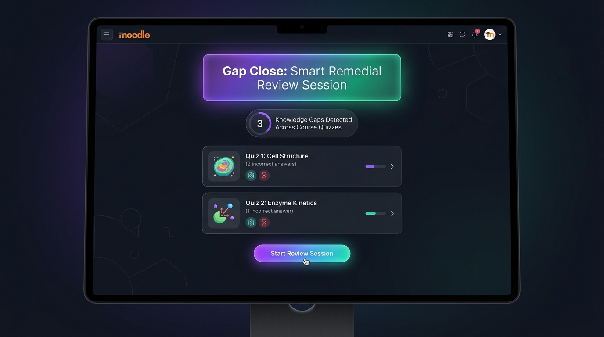
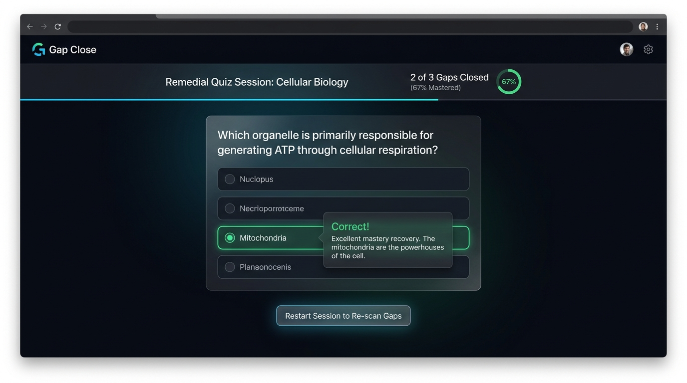

<p align="center">
  
</p>

<p align="center">
  <a href="https://moodle.org/plugins"></a>
  <a href="https://www.gnu.org/licenses/gpl-3.0"></a>
  <a href="#"></a>
  <a href="#"></a>
  <a href="#"></a>
</p>

<p align="center">
  <strong>Transform Past Quiz Mistakes into an Interactive Remedial Review Session.</strong><br>
  An innovative Moodle activity module (<code>mod_gapcloser</code>) that automatically aggregates every question a student answered incorrectly across all quizzes in a course into a single, focused review session powered by Moodle's native <b>Question Engine</b>.
</p>

---

## 🌟 Why Gap Close?

In standard course workflows, students take quizzes, receive scores, and rarely revisit the specific questions they got wrong. Valued formative feedback gets lost across individual quiz review screens.

**Gap Close (`mod_gapcloser`) solves this problem by automating remedial review:**
Instead of requiring students or teachers to manually hunt through past attempts, **Gap Close scans the entire course, detects unmastered questions, and unites them into an interactive learning session.**

* **For Students:** Enjoy a frictionless, personalized review dashboard that highlights exact knowledge gaps. Answer questions with immediate, interactive feedback, and click **Restart** at any time to re-scan for new gaps after completing new course quizzes.
* **For Teachers & Instructors:** Provide automated remedial practice without lifting a finger or duplicating quiz banks. Questions remain synchronized with existing quizzes and question banks.
* **For Course Designers & Admins:** Purely formative practice with **zero gradebook overhead**. Features smart filtering that respects course visibility, excludes hidden quizzes, and ignores questions removed from a quiz after the attempt.

---

## 🎬 Visual Showcase & Interface

### 1. Hero Overview & Knowledge Gap Detection
<p align="center">
  
</p>

* **Automatic Course Scanning:** Scans all visible quizzes in the course and identifies incorrectly answered questions from the student's latest finished attempt.
* **Clear Gap Breakdown:** Displays exactly which quizzes have outstanding review questions so students know where to focus.

### 2. Interactive Remedial Quiz Session
<p align="center">
  
</p>

* **Native Moodle Question Engine:** Uses `question_engine::make_questions_usage_by_activity()` with `interactive` behaviour for instant feedback on each attempt.
* **Resumable & Restartable:** Sessions are automatically saved so students can pause and resume. A single click on **Restart** clears the current session and re-scans the course for fresh gaps.

### 3. Formative Remedial Analytics & Zero Gradebook Overhead
<p align="center">
  
</p>

* **Zero Gradebook Overhead:** Designed purely as an adaptive learning tool with no gradebook entries or grading stress.
* **Smart Filtering Engine:** Automatically excludes hidden quizzes, quizzes with no finished attempts, hidden question bank items, and questions removed from a quiz structure after an attempt.

---

## ✨ Comprehensive Features

<table>
<tr>
<td width="50%" valign="top">

### 🔍 Automatic Gap Detection
- **Whole-Course Aggregation:** Consolidates incorrectly answered questions across all visible course quizzes.
- **Latest Finished Attempt:** Evaluates only the most recent completed attempt (`state = 'finished'`) per quiz.
- **Precision Score Thresholding:** Identifies questions where `fraction < 0.9999` (less than 100% score) and treats `NULL` fractions as `0` (wrong).

</td>
<td width="50%" valign="top">

### 🧩 Question Engine Integration
- **Interactive Behaviour:** Built on Moodle's core Question Engine (`interactive` mode) for immediate hints and feedback.
- **Resumable Usages:** Links student sessions to Moodle `question_usages` via `uniqueid`, preserving progress across browser sessions.
- **Dynamic Re-scanning:** Students can restart their session at any point to refresh their question pool.

</td>
</tr>
<tr>
<td width="50%" valign="top">

### 🧹 Smart Filtering & Structure Awareness
- **Moodle 4.0+ Compatibility:** Uses `question_references` and `question_versions` tables to verify quiz structure.
- **Removed Question Shielding:** Questions that were deleted or removed from a quiz after an attempt are automatically excluded.
- **Hidden Item Filtering:** Ignores hidden quizzes and hidden question bank entries.

</td>
<td width="50%" valign="top">

### 🛡️ Role-Aware & Zero Gradebook Impact
- **Formative Learning Focus:** No gradebook column or grade calculation overhead.
- **Granular Capabilities:** Clear separation of admin/teacher instance creation (`mod/gapcloser:addinstance`) and student interaction (`mod/gapcloser:view`).
- **Clean Architecture:** Standard activity module (`mod_gapcloser`) following Moodle coding guidelines.

</td>
</tr>
</table>

---

## 📋 Requirements

| Requirement | Version / Details |
|-------------|-------------------|
| **Moodle** | **4.0 or later** (`2022041900`+) — uses `question_references` & `question_versions` tables |
| **PHP** | **7.4+** |
| **Plugin Type** | Activity module (`mod_gapcloser`) |
| **Database** | Fully supported across MySQL, MariaDB, PostgreSQL |

---

## 🗂️ Project Structure

```
gapcloser/
├── db/
│   ├── access.php       # Capability definitions (addinstance, view)
│   ├── install.php      # Post-install hook
│   ├── install.xml      # Database schema definitions
│   └── upgrade.php      # Upgrade scripts
├── lang/
│   └── en/
│       └── gapcloser.php # English language strings
├── pix/
│   └── icon.png         # Activity icon
├── lib.php              # Core Moodle API functions
├── mod_form.php         # Activity settings form
├── index.php            # Course-level activity listing
├── view.php             # Main activity logic & UI rendering
└── version.php          # Plugin version metadata
```

---

## 🗄️ Database Tables

| Table | Primary Purpose | Key Fields |
|-------|-----------------|------------|
| `mdl_gapcloser` | Stores each activity instance within a course | `id`, `course`, `name`, `intro`, `introformat`, `timecreated`, `timemodified` |
| `mdl_gapcloser_attempts` | Tracks student remedial review sessions | `id`, `gapcloserid`, `userid`, `uniqueid` (FK to `question_usages`), `timemodified`, `finished` |

---

## ⚙️ Question Selection Logic

The plugin applies a strict, deterministic filtering pipeline when constructing a remedial review session:

```
[All Course Quizzes]
       │
       ├──► Filter out hidden quizzes (checks course_modules visibility)
       ├──► Filter out quizzes with no finished student attempts
       │
       ▼
[Latest Finished Attempt per Quiz]  (ORDER BY attempt DESC)
       │
       ├──► Select questions where fraction < 0.9999 (or NULL fraction => 0)
       ├──► Verify against current quiz_slots + question_references (Moodle 4.0+)
       ├──► Exclude questions removed from quiz after attempt
       │
       ▼
[Active Remedial Session via Question Engine]
```

---

## 🚀 Installation & Usage

### 1. Installation

1. Download or clone this repository into your Moodle `mod/` directory:
   ```bash
   git clone https://github.com/Smartlearn-edu/moodle_mod_gapcloser.git /path/to/moodle/mod/gapcloser
   ```
   > ⚠️ **Important:** The folder **must** be named `gapcloser` inside `mod/` (not `mod_gapcloser` or `moodle_mod_gapcloser`).

2. Log in to your Moodle site as an administrator.
3. Navigate to **Site Administration → Notifications** and follow the prompts to complete the database installation.

### 2. Teacher Usage

1. Navigate to any course and toggle **Edit mode** on.
2. Click **Add an activity or resource** and select **Gap Close**.
3. Provide an activity name (e.g., *Course Knowledge Gap Review*) and save.
4. No further configuration or manual question picking is required!

### 3. Student Usage

1. Open the **Gap Close** activity from the course page.
2. Click **Start Review Session** — Gap Close will scan all your completed quizzes and gather missed questions.
3. If you have answered all questions correctly across all course quizzes, you will see:
   🎉 *"Great job! No incorrect answers to review."*
4. Answer questions with live feedback.
5. Click **Restart** at any time after attempting new course quizzes to refresh your remedial question pool.

---

## 🔐 Capabilities

| Capability | Allowed Roles | Description |
|------------|---------------|-------------|
| `mod/gapcloser:addinstance` | Manager, Editing Teacher | Add a new Gap Close activity to a course |
| `mod/gapcloser:view` | Student, Teacher, Editing Teacher, Manager | View and interact with the Gap Close activity |

---

## 🏷️ Version Info

| Field | Value |
|-------|-------|
| **Component** | `mod_gapcloser` |
| **Release** | `v1.0.0` |
| **Required Moodle** | `4.0+` (`2022041900`) |
| **License** | [GNU GPL v3 or later](http://www.gnu.org/copyleft/gpl.html) |

---

## 📄 License

This plugin is free software: you can redistribute it and/or modify it under the terms of the **GNU General Public License** as published by the Free Software Foundation, either version 3 of the License, or any later version.

See [http://www.gnu.org/licenses/](http://www.gnu.org/licenses/) for details.
