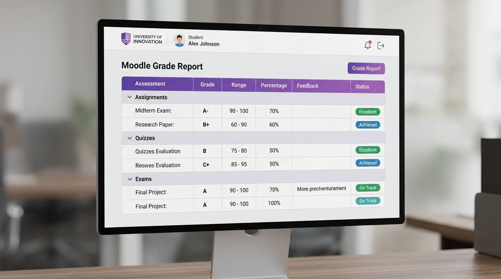
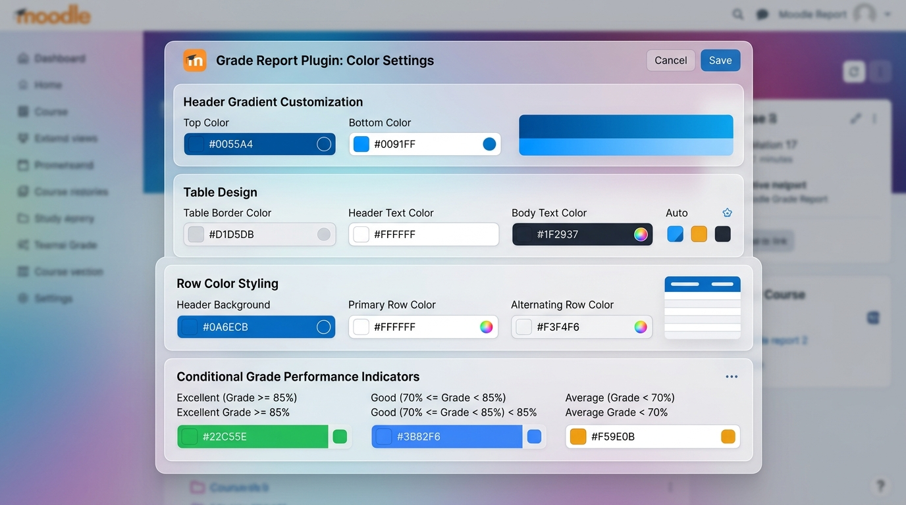
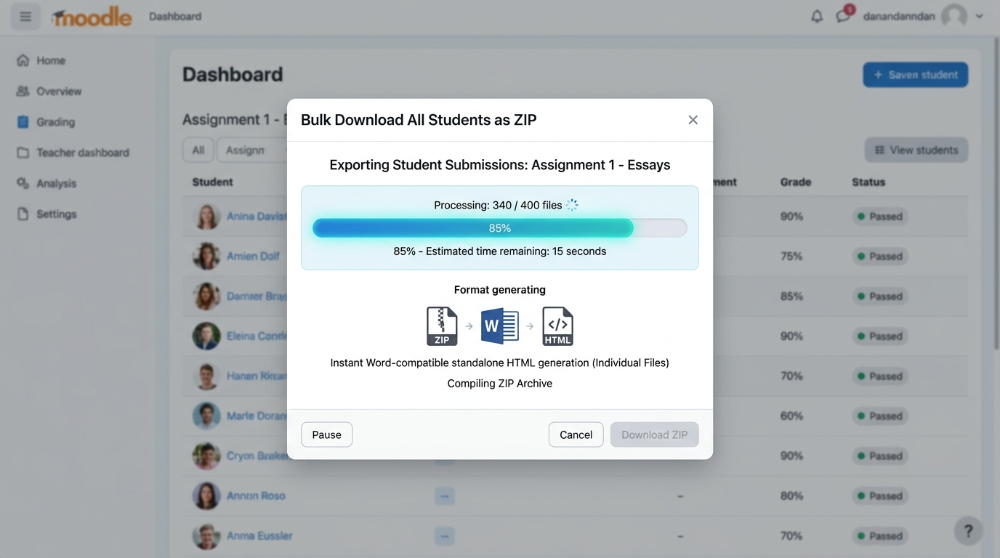

<p align="center">
  
</p>

<p align="center">
  <a href="https://moodle.org/plugins"></a>
  <a href="https://www.gnu.org/licenses/gpl-3.0"></a>
  <a href="#"></a>
  <a href="#"></a>
  <a href="#"></a>
</p>

<p align="center">
  <strong>Stop Struggling with Unformatted Grade Spreadsheets. Export Beautiful, Word-Compatible HTML Reports Instantly.</strong><br>
  An all-in-one, highly customizable grade reporting tool built for <b>Teachers</b>, <b>Editing Teachers</b>, <b>Managers</b>, and <b>Admins</b>.
</p>

---

## 🌟 Why HTML Export Grade Report?

Default LMS grade exports often produce raw CSV or spreadsheet files that strip away your gradebook's visual hierarchy, category subtotals, and institutional branding—requiring hours of manual formatting before they can be shared with students, parents, or auditors.

**HTML Export Grade Report changes everything.**
Transform your Moodle gradebook into standalone, professionally designed documents in a single click.

* **For Administrators:** Maintain perfect institutional branding site-wide. Configure 18+ custom color tokens, integrate your site logo automatically, and ensure GDPR privacy compliance without third-party tools.
* **For Teachers & Instructors:** Save hours of manual document formatting. Download individual student reports or bulk-export an entire course into a neat ZIP archive of standalone HTML files in seconds.
* **For Students & Parents:** Receive crystal-clear, beautifully formatted academic records with conditional color-coded performance badges, accurate category totals, and Word-compatible layouts ready for printing or archiving.

---

## 🎬 Visual Showcase

### 1. Hero Overview & Student Grade Report Table
<p align="center">
  
</p>

* **Hero Overview:** A clean, modern HTML grade report displaying clear assessment hierarchies, category totals, conditional performance badges (**Excellent**, **On Track**, **Achieved**), and automatic site logo integration.

### 2. Comprehensive Color Customization & Admin Settings
<p align="center">
  
</p>

* **Admin Customization:** Tailor every visual element via `Site Administration > Plugins > Grade Reports > HTML Export`. Configure custom header gradients, table borders, row alternate styling, and conditional performance thresholds.

### 3. Bulk Export & Word-Compatible HTML Download
<p align="center">
  
</p>

* **Bulk Export Engine:** Download all student grade reports simultaneously in a convenient ZIP archive. Every exported HTML file is completely standalone and natively compatible with Microsoft Word and web browsers.

---

## ✨ Comprehensive Features

<table>
<tr>
<td width="50%" valign="top">

### 📄 Individual & Bulk Export
- **One-Click Individual Export:** Generate standalone HTML grade reports for single students instantly.
- **Bulk Course Export:** Package all student grade reports in a course into a single ZIP archive.
- **Large Course Support:** Interactive progress dialog with safe memory handling for courses with hundreds of students.
- **Word Compatibility:** Open any exported HTML file directly in Microsoft Word with formatting intact.

</td>
<td width="50%" valign="top">

### 🎨 18+ Color Customization Settings
- **Header Gradients:** Configure custom primary and secondary hex colors for modern gradient headers.
- **Performance Indicators:** Customize colors for **Excellent**, **Good**, **Average**, and **Poor** grade badges.
- **Table Theme Controls:** Manage table border colors, row hover effects, and alternating row backgrounds.
- **Reset to Default:** Built-in reset utility to instantly restore standard styling.

</td>
</tr>
<tr>
<td width="50%" valign="top">

### 🌳 Hierarchical Gradebook Structure
- **Accurate Groupings:** Preserves Moodle's native category hierarchies and nested items.
- **Category & Course Totals:** Automatically calculates and displays category subtotals and grand course totals.
- **Conditional Formatting:** Highlights percentage and grade value cells with custom visual cues based on student scores.
- **Visibility Awareness:** Respects hidden grade items and student grade viewing permissions.

</td>
<td width="50%" valign="top">

### 🖨️ Print-Ready & Accessibility First
- **Print-Optimized CSS:** Styled with print stylesheets for clean PDF printing and physical documentation.
- **Site Branding Integration:** Dynamically pulls and displays the institution's official logo.
- **Full RTL Support:** Native Right-to-Left language layout for Arabic, Hebrew, and Persian languages.
- **GDPR Privacy API:** Fully integrated Moodle Privacy API ensuring zero unauthorized data storage.

</td>
</tr>
</table>

---

## ⚙️ Installation

### Standard Installation via Directory

1. **Download** the latest release ZIP file of `gradereport_htmlexport`.
2. **Extract** the contents into your Moodle installation directory under:
   ```bash
   /path/to/moodle/grade/report/htmlexport/
   ```
3. **Upgrade Database:** Visit `Site Administration > Notifications` in your Moodle site to complete the installation and register the plugin database tables.
4. **Configure Theme & Colors:** Navigate to `Site Administration > Plugins > Grade Reports > HTML Export` to customize your institution's color palette, logo display, and default performance indicators.

---

## 🛡️ Permissions & Capabilities

The plugin defines granular capabilities to ensure secure access control across different user roles:

| Capability | Default Assigned Roles | Description |
| :--- | :--- | :--- |
| `gradereport/htmlexport:view` | **Teacher**, **Editing Teacher**, **Manager** | Allows users to view the HTML export interface and generate individual or bulk student reports. |

---

## 🚀 Release Notes (Changelog)

### Version 3.0.0 - *Major Release*
- **NEW:** Comprehensive color customization system with 18+ configurable colors via Admin settings.
- **NEW:** Integrated Privacy API implementation for full GDPR compliance.
- **IMPROVED:** Robust error and fallback handling for site logos, role checks, and missing grades.
- **IMPROVED:** CSS namespacing to prevent any conflicts with third-party Moodle themes.

<details>
<summary><b>View Previous Releases</b></summary>

### Version 2.1.1
- **FIX:** Enhanced logo detection prioritizing site-wide branding settings.
- **IMPROVED:** Upgraded CSS with modern rounded styling and visual hierarchy.

### Version 2.1.0
- **NEW:** Site logo integration, category totals, and conditional color-coded performance badges.
- **IMPROVED:** Modern styling with rounded borders, subtle shadows, and print-friendly layouts.

### Version 2.0.0
- **NEW:** Bulk download functionality allowing full-course export as a ZIP archive.
- **NEW:** Progress confirmation dialog for large courses.
- **IMPROVED:** Enhanced teacher-only capabilities and permission checks.

### Version 1.0.0
- *Initial Stable Release.*
</details>

---

## 🔒 Privacy & Data Protection

**This plugin does not store any personal data.**  
It operates strictly as a real-time export interface for grade data already managed within Moodle's core database. Exported HTML files and ZIP archives are generated on the fly and are never persistently saved on the web server.

---

## 📝 License

This hardware/software is licensed under the **GNU GPL v3 or later**.  
Please visit [http://www.gnu.org/copyleft/gpl.html](http://www.gnu.org/copyleft/gpl.html) for complete terms and licensing details.

---

<p align="center">
  <i>Developed with ❤️ for the Moodle Community by SmartLearn Education.</i>
</p>
