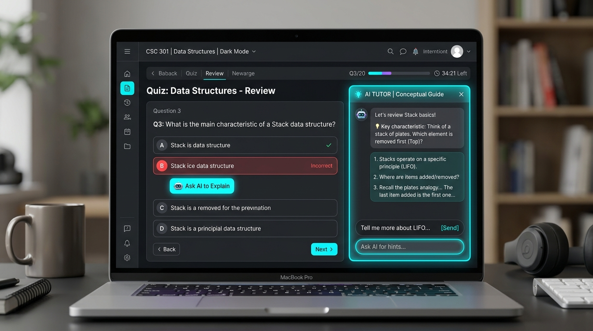
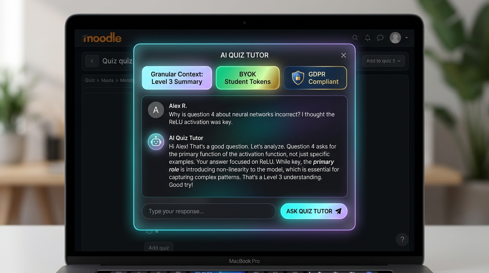

<p align="center">
  
</p>

<p align="center">
  <a href="https://moodle.org/plugins"></a>
  <a href="https://www.gnu.org/licenses/gpl-3.0"></a>
  <a href="#"></a>
  <a href="#"></a>
  <a href="#"></a>
</p>

<p align="center">
  <strong>Empower Students with Context-Aware, On-Demand AI Quiz Tutoring While Mastering AI Token Economics.</strong><br>
  A state-of-the-art Moodle plugin (<code>local_qai</code>) that integrates Moodle's native AI Subsystem and Bring-Your-Own-Token (BYOK) architecture directly into quiz reviews and performance feedback.
</p>

---

## 🌟 Why Moodle Quiz AI Chat (`local_qai`)?

Traditional automated quizzes provide static correct/incorrect feedback, leaving students confused about *why* their reasoning was wrong. Meanwhile, institutions want to provide 1-on-1 AI tutoring to every student but are rightfully concerned about runaway API costs and token consumption.

**Moodle Quiz AI Chat (`local_qai`) solves both challenges:**

*   **For Students:** Transforms quiz reviews into an interactive, conversational learning experience. Students can click **"Ask AI to Explain"** on any individual question to understand concepts, review mistakes, and receive guided hints—or click **"Ask AI about Quiz"** to discuss their overall quiz performance and study strategies.
*   **For Teachers & Instructors:** Retain complete pedagogical control. Configure granular **AI Context Levels** (from high-level summaries down to full question/answer details), inject custom pedagogical teaching prompts, and prevent answers from being revealed prematurely.
*   **For Administrators & Institutions:** Eliminate unpredictable AI bills with a **Fair Bring-Your-Own-Token (BYOK) Architecture**. Natively prioritizes student tokens via `local_aihub` while offering a customizable, capability-protected fallback to the institution's Moodle `core_ai` account.

---

## 🎬 Visual Showcase

### 1. Interactive Per-Question AI Tutor ("Ask AI to Explain")
<p align="center">
  
</p>

*   **Contextual Question Guidance:** Students reviewing their attempts see an **Ask AI to Explain** button attached natively to each quiz question.
*   **Socratic Tutoring Mode:** The AI tutor explains underlying concepts and reasoning without simply feeding answers, encouraging critical thinking.

### 2. Granular Context Control & Modal Conversation
<p align="center">
  
</p>

*   **Seamless In-Page Chat:** A responsive glassmorphism modal opens instantly without navigating away from the quiz attempt.
*   **5 Context Levels:** Teachers choose exactly how much data (questions, choices, answers, feedback, scores) is transmitted to the LLM to optimize helpfulness and token usage.

### 3. Fair BYOK Architecture & Token Routing
<p align="center">
  
</p>

*   **Student-Funded Usage First:** Automatically checks `local_aihub` for student-owned API tokens before making institutional calls.
*   **Intelligent Institutional Fallback:** Admins can enforce strict BYOK, grant capability-based fallback permissions to specific users, or enable open institutional fallback.

---

## 🚀 Key Features

| Feature | Description |
| :--- | :--- |
| **Per-Question AI Tutoring (`askai`)** | Natively attaches an interactive **Ask AI to Explain** button to individual quiz questions during attempt review. |
| **Quiz-Level Performance Chat (`askaboutquiz`)** | Offers an **Ask AI about Quiz** button on the review summary for holistic feedback, score analysis, and study recommendations. |
| **5 Granular Context Levels** | Configure AI context depth: **Level 5** (Full Detail), **Level 4** (Standard), **Level 3** (Summary - Recommended), **Level 2** (Minimal), or **Level 1** (Free chat). |
| **Token Efficiency Optimization** | Optional **Send first only** setting transmits question context on the initial prompt only, saving tokens on extended follow-up chat turns. |
| **BYOK AI Hub Integration** | Works natively with `local_aihub`, empowering students to plug in their own personal API keys or allocated tokens. |
| **3-Tier Fallback Provider Engine** | Full admin control over Moodle `core_ai` institutional fallback: **Strict** (AI Hub only), **Capability-Based**, or **Enabled for All**. |
| **Built-in Access Manager UI** | Dedicated administrative interface (`manage_users.php`) to search users and grant explicit fallback permissions (`local/qai:usecoreai`). |
| **Custom Pedagogical Prompts** | Teachers can define custom **Question Prompts** and **Quiz Prompts** to guide tone, tutoring style, and instructional boundaries. |
| **100% GDPR & Privacy API Compliant** | Fully integrates with Moodle's Privacy API (`privacy\provider`) for complete personal chat history export and erasure. |
| **Backup & Restore Integration** | Custom AI settings for each quiz are preserved automatically during Moodle course backups and restores. |

---

## 🏗 Architecture & Token Routing Workflow

```
+-----------------------------------+
|     Student Reviews Quiz Attempt  |
|  ("Ask AI to Explain" / Quiz Chat)|
+-----------------------------------+
                  |
                  v
+-----------------------------------+
|       local_qai Dispatcher        |
|  (Applies Context Level & Prompts)|
+-----------------------------------+
                  |
                  v
+-----------------------------------+
|      Check BYOK / AI Hub Tokens   |
|         (local_aihub API)         |
+-----------------------------------+
         /                 \
  (Tokens Available)    (Out of Tokens / Not Installed)
       /                     \
       v                      v
+------------------+    +-----------------------------------+
| Student API Key  |    |  Check Institutional Fallback     |
|   (BYOK Route)   |    |    (core_ai_fallback Setting)     |
+------------------+    +-----------------------------------+
                               |                   |
                     (Strict / No Cap)     (Capability / Enabled)
                               |                   |
                               v                   v
                     +------------------+    +------------------+
                     |  Access Blocked  |    |  Moodle Core AI  |
                     |  (User Notice)   |    |  (Institutional) |
                     +------------------+    +------------------+
```

---

## 📋 Requirements

*   Moodle **4.5** or later (requires Moodle Core AI Subsystem and modern Modal API).
*   Moodle Core `mod_quiz` module.
*   An active text-generation AI provider configured in Moodle (*Site administration > General > AI > AI providers*) OR `local_aihub` installed for BYOK student token management.

---

## 📦 Installation

### Method 1: Git Installation (Recommended)
1. Navigate to your Moodle root directory and clone the repository into `local/qai`:
   ```bash
   git clone <repository-url> local/qai
   ```
2. Run the Moodle CLI database upgrade:
   ```bash
   php admin/cli/upgrade.php
   ```

### Method 2: Manual Zip Installation
1. Download the plugin archive and extract it.
2. Rename the folder to `qai` (if not already named `qai`).
3. Upload/copy the folder to `your-moodle-site/local/qai`.
4. Log in as Site Administrator and complete the database upgrade wizard.

---

## 🛠️ Configuration & Usage

### 1. Site Administration Setup
*   Navigate to **Site administration > Plugins > Local plugins > Quiz AI Chat**.
*   Configure the **AI Fallback Provider** setting (`coreai_fallback`):
    *   **Strict:** Students must have their own tokens in `local_aihub`.
    *   **Capability-Based:** Fallback to `core_ai` only for users granted the `local/qai:usecoreai` capability.
    *   **Enabled:** Allow all students to use Moodle's institutional `core_ai` fallback.
*   Use **Manage AI Fallback Access** to grant capability exceptions to teachers or specific students.

### 2. Quiz-Level Teacher Setup
*   Navigate to any Moodle Quiz as a Teacher or Administrator.
*   Click **More > AI Chat Settings** in the quiz navigation menu.
*   Set your preferred **AI Context Level** (Level 3 Summary recommended).
*   Toggle **Show "Ask AI to Explain" button** and/or **Show "Ask AI about Quiz" button**.
*   (Optional) Enter custom guidance in **Question Prompt** or **Quiz Prompt**.
*   Click **Save changes**.

---

## ⚖️ License

This plugin is licensed under the [GNU General Public License v3 or later](https://www.gnu.org/licenses/gpl-3.0.html).

---
*Built with ❤️ for modern Moodle environments.*
