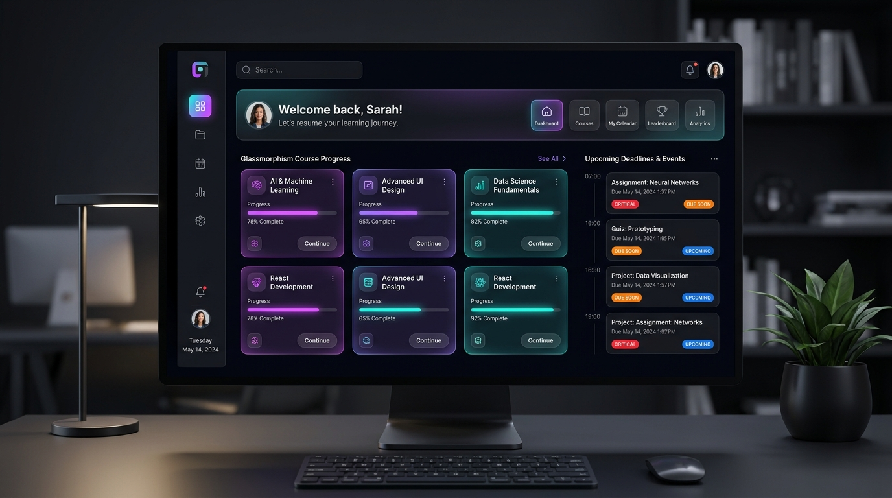
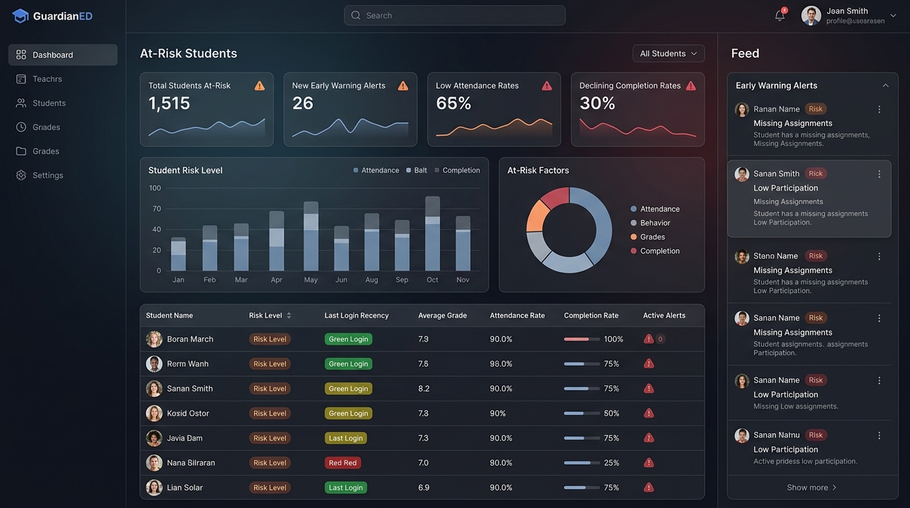
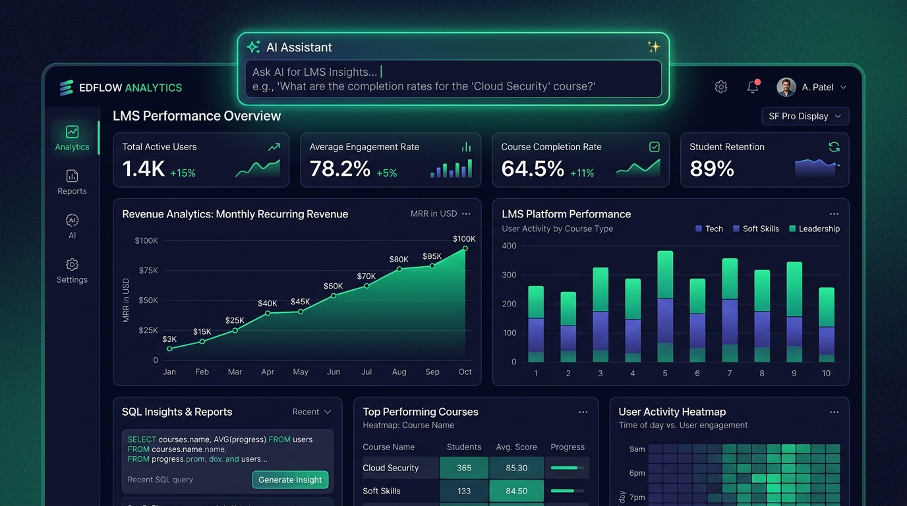

<p align="center">
  
</p>

<p align="center">
  <a href="https://moodle.org/plugins"></a>
  <a href="https://www.gnu.org/licenses/gpl-3.0"></a>
  <a href="#"></a>
  <a href="#"></a>
  <a href="#"></a>
</p>

<p align="center">
  <strong>Stop Managing Moodle the Hard Way. Turn Hidden Data into Real-Time Intelligence.</strong><br>
  An all-in-one, premium dark-mode analytics dashboard built for <b>Students</b>, <b>Teachers</b>, <b>Managers</b>, <b>Parents</b>, and <b>Admins</b>.
</p>

---

## 🌟 Why Smart Dashboard?

Your LMS already contains thousands of valuable insights—but Moodle makes them almost impossible to find without endless clicking across scattered pages.

**Smart Dashboard changes everything.**
Instead of digging through Moodle, **Moodle comes to you.**

* **For Administrators:** Save hours every week. Track real revenue, monitor system health, and build AI-assisted SQL reports in seconds without spreadsheets.
* **For Teachers:** Stop clicking through 40 courses to find pending submissions. Grade everything from a centralized grading queue and identify struggling students before they drop out.
* **For Students & Parents:** Stay motivated with a stunning, personalized hub featuring real-time progress bars, color-coded deadline timelines, study agendas, and parent/mentor KPI dashboards.

---

## 🎬 Visual Showcase

### 1. Hero Overview & Welcome Banner
<p align="center">
  
</p>

* **Hero Overview:** Primary landing page hero mockup showcasing the dark-mode glassmorphism UI, student welcome banner, shortcut icons grid, and color-coded deadline timeline.

### 2. At-Risk Student Early Warning System
<p align="center">
  
</p>

* **Retention Dashboard:** Feature spotlight for teacher retention tools, early warning badges, and modular risk scores.

### 3. AI Magic Reports & SQL Insights Hub
<p align="center">
  
</p>

* **AI Hub Integration:** Enterprise and administrator feature showcase highlighting natural language query conversion and automated reporting.

---

## ✨ Comprehensive Features

<table>
<tr>
<td width="50%" valign="top">

### 📊 Hero Course Overview & Shortcuts
- **Personalized Welcome Banner:** Dynamic greeting with student avatar and quick-access status.
- **Customizable Shortcuts Grid:** Configure up to 10 quick-access icons (URL, custom CSS classes, and labels) for seamless navigation.
- **Course Progress Cards:** Interactive course cards featuring student counts, custom banners, and cross-course completion progress bars.

</td>
<td width="50%" valign="top">

### 👥 Student Progress & Deadlines
- **Cross-Course Progress Tracking:** Unified completion tracking across all enrolled courses.
- **Color-Coded Deadline Timeline:** Upcoming assignments and quizzes categorized by urgency (**Critical**, **Due Soon**, **Upcoming**).
- **My Grades Summary:** Compact snapshot of academic performance across all subjects.
- **Activity Drill-Down:** Inspect detailed per-activity completion statuses.

</td>
</tr>
<tr>
<td width="50%" valign="top">

### ⚠️ Modular At-Risk Alert System
- **Proactive Early Warning Engine:** Detects at-risk students before they drop out using modular `smartdashboardrule` subplugins:
  - `loginrecency`: Monitors inactivity thresholds.
  - `coursecompletion`: Tracks stalled progress.
  - `grades` & `safetynet70`: Flags low average scores.
  - `overdue` & `adaptiveplan`: Identifies missed deadlines.
- **n8n Webhook Integration:** Send real-time webhook payloads to external systems for instant SMS/Email/Slack alerts.

</td>
<td width="50%" valign="top">

### 🔮 AI Magic Reports & SQL Hub
- **Natural Language to SQL:** Ask questions in plain English and let AI generate complex SQL queries automatically via `local_aihub` (with `core_ai` fallback).
- **Interactive Visualizers:** Transform query results into dynamic charts, revenue graphs, and KPI tables.
- **Report Management:** Save, load, execute, and delete custom reports securely.

</td>
</tr>
<tr>
<td width="50%" valign="top">

### 👨‍👩‍👧 Parent & Mentor 360° Portal
- **Mentee Switcher:** Easily toggle between multiple assigned students or mentees.
- **Program Filtering:** Dynamically filter mentees based on enrolled programs (via `enrol/programs` integration).
- **Visual Analytics:** View Grade Progression charts, Subject Mastery radar graphs, and Weekly Engagement Heatmaps.
- **KPI At-Risk Indicators:** Study streak counters, total interactions, and immediate early-warning badges.

</td>
<td width="50%" valign="top">

### 📅 Grading Queue & Daily Plan
- **Centralized Teacher Grading:** Single-page queue showing all pending submissions across every course you teach.
- **Today's Agenda (Daily Plan):** Dynamically synchronizes student task schedules with Moodle Adaptive Study Plans (`mod_adaptiveplan`).
- **Homework Breakdown:** Clean checklist of due assignments with direct grading links.

</td>
</tr>
<tr>
<td width="50%" valign="top">

### 💰 Revenue & Payment Analytics
- **Estimated vs. Actual Revenue:** Automatic financial tracking with interactive comparison charts.
- **Category-Level Financials:** See which course categories generate the highest ROI.
- **Exportable Records:** One-click CSV exports for accounting and auditing.
- **Currency & Date Filters:** Easily filter revenue by time ranges and currency toggles.

</td>
<td width="50%" valign="top">

### 📣 News, Security & i18n
- **Centralized News & Announcements:** Pulls announcements from site and course news forums with AJAX dismissal.
- **Strict Moodle Security:** 100% compliant with Moodle's External Services API and Privacy API standards.
- **Multilingual Support:** Out-of-the-box localization for **English**, **Spanish**, and **Arabic** (including full Right-to-Left RTL layout support).

</td>
</tr>
</table>

---

## ⚡ Workflow Transformation: Moodle Default vs. Smart Dashboard

| Task | Moodle Default Workflow | Smart Dashboard Workflow | Time Saved |
|---|---|---|---|
| **Check Pending Grading** | Click course → Click assignment → Check submissions → Repeat 10+ times | Open Smart Dashboard → View **Grading Queue** across all courses | **85% Faster** |
| **Identify At-Risk Students** | Export logs to Excel → Calculate login recency & grade averages manually | Open **At-Risk Alerts** → Instant risk score badges & n8n webhook triggers | **95% Faster** |
| **Custom Data Insights** | Write complex custom SQL queries in database admin tools | Use **AI Magic Reports** → Type natural language question & view chart | **90% Faster** |
| **Student Daily Plan** | Check each course calendar separately | Open **Today's Agenda** → Unified daily study plan | **80% Faster** |

---

## 🚀 Installation

### Option 1 — Download ZIP (Recommended)
1. Download the latest release ZIP from the [Releases](../../releases) page.
2. Log into Moodle as an Administrator and navigate to **Site Administration → Plugins → Install plugins**.
3. Upload the ZIP file and follow the on-screen prompts.

### Option 2 — Git Clone
```bash
cd /path/to/moodle/local
git clone https://github.com/Smartlearn-edu/moodle_local_smartdashboard.git smartdashboard
```
After cloning, log into your Moodle site and visit **Site Administration → Notifications** to complete the database upgrade.

> ⚠️ **Important:** The directory inside `/local/` MUST be named exactly **`smartdashboard`**.

---

## 🔧 Usage & Configuration

Once installed, users can access their personalized dashboard at:
```text
https://your-moodle-site.com/local/smartdashboard/
```

### Role-Based Access Control
* **Students:** Access via `Authenticated user` archetype. Views Welcome Banner, My Courses progress, upcoming deadlines, grades summary, and daily agenda.
* **Parents / Mentors:** Switch between mentees, filter by program, and inspect engagement heatmaps and grade progression.
* **Teachers:** Inspect course overviews, grading queues, student completion drill-downs, and at-risk early warning badges.
* **Managers & Admins:** Full system access including Payment Analytics, AI Magic Reports, category analytics, and dashboard settings configuration.

### 🧩 Adding Moodle Blocks to Smart Dashboard
By default, some Moodle blocks restrict themselves to course pages or the standard Moodle dashboard. To allow a block to be added to Smart Dashboard, add the `'local-smartdashboard-*'` format to the block's `applicable_formats()` method:

```php
public function applicable_formats() {
    return [
        'course-view'            => true,
        'site'                   => true,
        'my'                     => true,
        'local-smartdashboard-*' => true, // <-- Enable for Smart Dashboard
    ];
}
```
> **Tip:** Remember to purge Moodle caches (**Site administration → Development → Purge caches**) after modifying block code.

---

## 🌐 External Web Services API Reference

All data exchanges use Moodle's secure **External Services API** (`local_smartdashboard_webservice`):

| Web Service Method | Type | Description |
|---|---|---|
| `local_smartdashboard_get_cross_course_progress` | `read` | Retrieve cross-course completion percentage and progress |
| `local_smartdashboard_get_student_detailed_progress` | `read` | Fetch activity-level completion breakdown for a student |
| `local_smartdashboard_get_grading_overview` | `read` | Retrieve pending grading tasks across all teaching courses |
| `local_smartdashboard_get_system_analytics` | `read` | Retrieve system-wide enrollment & category statistics |
| `local_smartdashboard_get_payment_analytics` | `read` | Retrieve estimated vs. actual revenue analytics |
| `local_smartdashboard_save_dashboard_settings` | `write` | Persist admin settings (e.g., payment calculation mode) |
| `local_smartdashboard_get_dashboard_settings` | `read` | Retrieve current dashboard configuration |
| `local_smartdashboard_get_cross_course_grades` | `read` | Fetch student grades across enrolled courses |
| `local_smartdashboard_get_magic_insight` | `read` | Generate AI SQL query & chart insight via AI Hub |
| `local_smartdashboard_save_magic_report` | `write` | Save a custom AI-generated report configuration |
| `local_smartdashboard_get_saved_reports` | `read` | List all saved Magic Reports for the user |
| `local_smartdashboard_delete_magic_report` | `write` | Delete a saved Magic Report |
| `local_smartdashboard_get_programs` | `read` | Retrieve programs & associated courses (`enrol/programs`) |
| `local_smartdashboard_dismiss_announcement` | `write` | AJAX dismissal for news forum announcements |
| `local_smartdashboard_get_daily_plan` | `read` | Retrieve student daily schedule (`mod_adaptiveplan`) |
| `local_smartdashboard_get_risk_data` | `read` | Retrieve at-risk student engagement tracking data |
| `local_smartdashboard_send_n8n_data` | `write` | Send webhook payloads to external n8n automation servers |
| `local_smartdashboard_test_ai` | `read` | Test AI integration for automated grade analysis |

---

## 📋 Requirements

| Requirement | Supported Version |
|---|---|
| **Moodle** | 4.0, 4.1, 4.2, 4.3, 4.4, 4.5, 5.0+ |
| **PHP** | 7.4, 8.0, 8.1, 8.2, 8.3+ |
| **Browser** | Modern browsers with CSS Grid & Backdrop Filter support |
| **Optional Integrations** | `local_aihub` / Moodle Core AI, `mod_adaptiveplan`, `enrol_programs` |

---

## 🗂️ Plugin Architecture

```
smartdashboard/
├── amd/
│   ├── src/main.js                    # Frontend interactive logic (AMD module)
│   └── build/main.min.js             # Compiled minified build
├── classes/
│   ├── external/
│   │   ├── analytics.php             # Core analytics & progress endpoints
│   │   ├── grading.php               # Grading queue API
│   │   ├── magic_analytics.php       # AI Magic Reports & SQL generator
│   │   ├── risk.php                  # At-Risk student tracking API
│   │   ├── n8n_webhook.php           # n8n webhook external integrations
│   │   └── announcements.php         # News & announcement dismissal API
│   └── output/
│       └── dashboard.php             # Moodle renderable output class
├── db/
│   ├── services.php                  # Web service function definitions
│   └── subplugins.json               # Subplugin definition for smartdashboardrule
├── rules/                            # Modular At-Risk assessment rules
│   ├── loginrecency/                 # Login inactivity detector
│   ├── coursecompletion/             # Stalled progress detector
│   ├── grades/                       # Low grade detector
│   ├── overdue/                      # Overdue assignment detector
│   ├── adaptiveplan/                 # Adaptive study plan risk detector
│   └── safetynet70/                  # 70% safety net score detector
├── lang/
│   ├── en/local_smartdashboard.php   # English language pack
│   ├── ar/local_smartdashboard.php   # Arabic language pack (RTL)
│   └── es/local_smartdashboard.php   # Spanish language pack
├── templates/
│   └── dashboard.mustache            # Mustache UI layout template
├── .github/
│   └── screenshots/                  # Promotional & interface reference images
├── index.php                         # Dashboard entry point
├── styles.css                        # Vanilla CSS dark mode styling & glassmorphism
└── version.php                       # Plugin metadata (v1.6.0)
```

---

## 🤝 Contributing

We welcome community contributions to make Smart Dashboard even better!
1. **Fork** the repository.
2. Create a **Feature Branch** (`git checkout -b feature/amazing-feature`).
3. **Commit** your changes (`git commit -m 'Add amazing feature'`).
4. **Push** to the branch (`git push origin feature/amazing-feature`).
5. Open a **Pull Request**.

---

## 📄 License & Credits

Licensed under the [GNU General Public License v3.0](https://www.gnu.org/licenses/gpl-3.0.html).

<p align="center">
  Made with ❤️ by <a href="https://smartlearn.education"><strong>SmartLearn Education</strong></a><br>
  <em>Transforming Moodle from a learning platform into a decision-making platform.</em>
</p>
