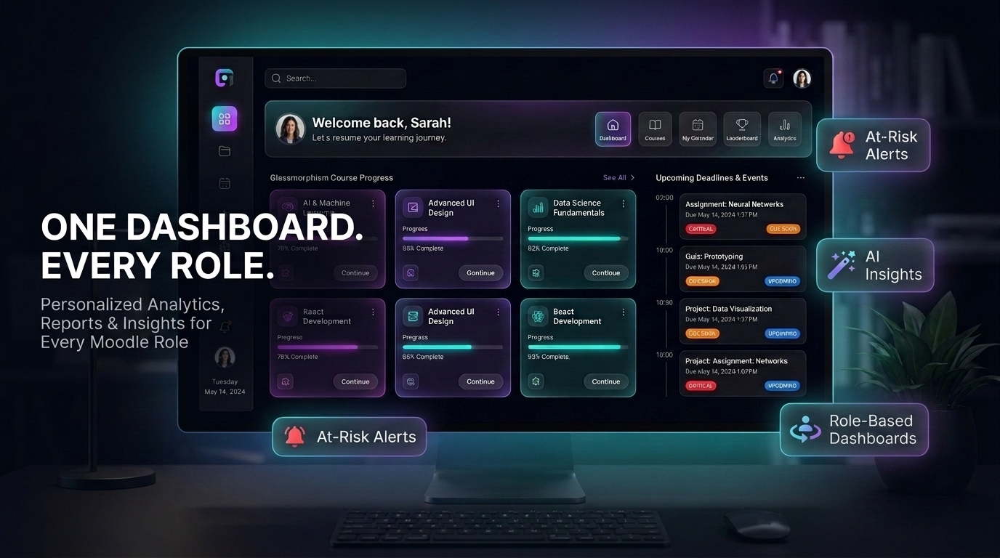

# Smart Dashboard — Promotional Banner Samples (Style 6 Gold Standard)

Below is **Style 6 (Refined Final)** — our chosen **Gold Standard 70/30 Apple-Style Hybrid** for all Moodle plugins in your catalog!

---

## 🏆 THE GOLD STANDARD: Style 6 (Refined Final)
**Why this is the chosen standard:**
- **Believable Real UI:** Displays the real Smart Dashboard interface on a sleek monitor—building immediate trust.
- **Benefit-Driven Headline:** **"ONE DASHBOARD. EVERY ROLE."** with the subtitle *"Personalized Analytics, Reports & Insights for Every Moodle Role"*.
- **Refined Apple-Style Feature Badges:**
  - `At-Risk Alerts`
  - `AI Insights` *(refined enterprise phrasing)*
  - `Role-Based Dashboards` *(instant multi-role clarity)*
- **Clean Whitespace & Aesthetic:** Apple / Linear dark obsidian aesthetic (`#0B0E14`) with glowing cyan and violet ambient light.

---

## Complete Asset Library in SAMPLES/
- **`banner_smartdashboard_final.jpg`** — The ready-to-use primary promo banner (identical to `banner_sample_opt6_refined_final.jpg`).
- **`banner_sample_opt6_refined_final.jpg`** — Style 6 with refined callout copy (`AI Insights`, `Role-Based Dashboards`).
- **`banner_sample_opt6_champion_hybrid.jpg`** — Style 6 initial version.
- **`banner_sample_opt1_obsidian.jpg`** — Option 1 (Obsidian Glassmorphism).
- **`banner_sample_opt2_aimagic.jpg`** — Option 2 (AI Magic & Neural).
- **`banner_sample_opt3_multirole.jpg`** — Option 3 (360° Multi-Role Ecosystem).
- **`banner_sample_opt4_retention.jpg`** — Option 4 (Proactive Retention).
- **`banner_sample_opt5_isometric.jpg`** — Option 5 (Isometric 3D Command Center).

---

### Ready for the next plugin!
This **Style 6 (70/30 Apple-Style Callout Hero)** is now formalized as our universal template to be generalized across all remaining Moodle plugins!
