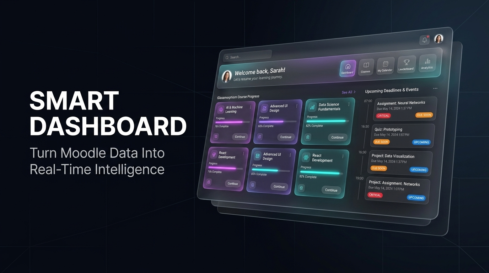
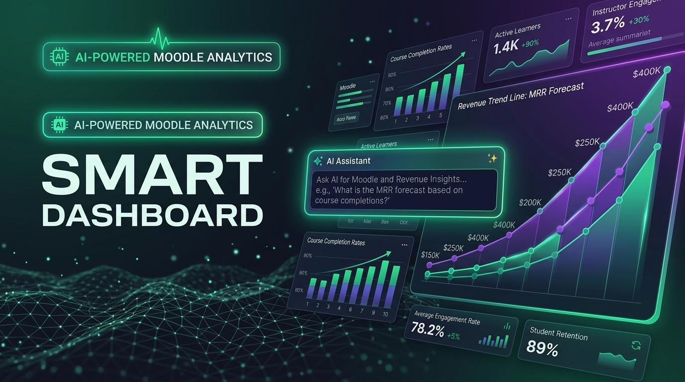
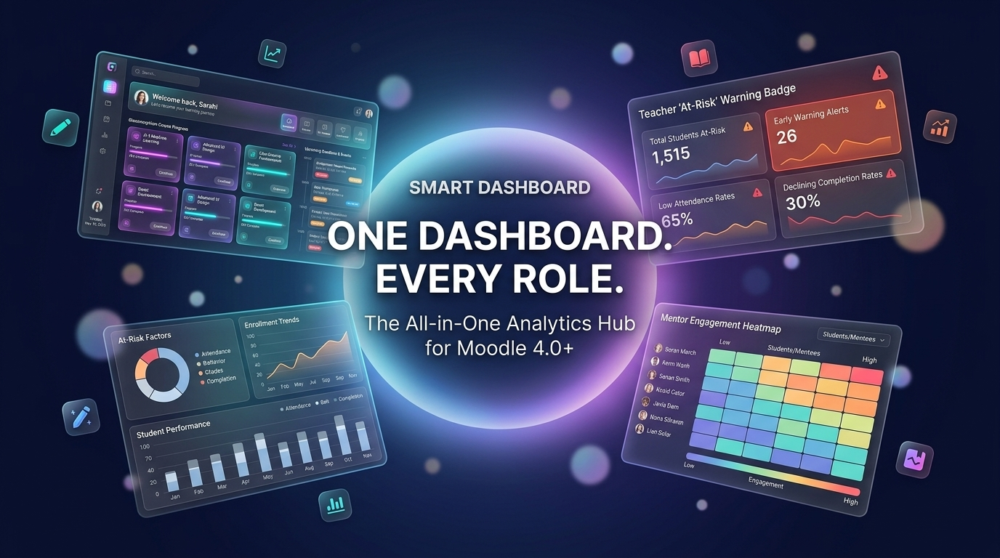
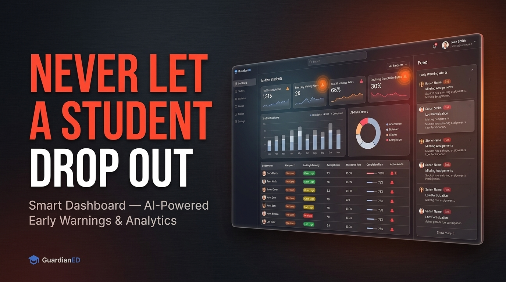
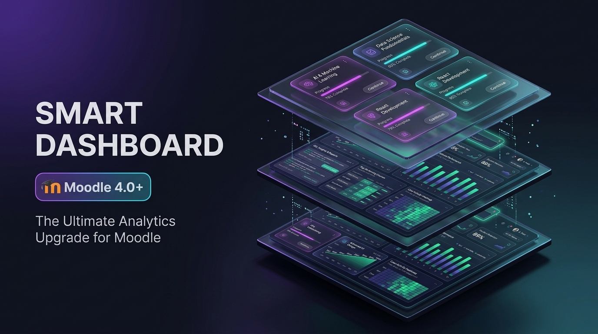

# Smart Dashboard — Promotional Banner Samples (5 Styles Showcase)

Below are the **5 sample 16:9 promotional banners** generated for **Smart Dashboard**. Each style highlights a different visual angle and aesthetic from the plugin's README. 

Review the options below to pick the winning style that you'd like us to generalize across all plugins in your catalog!

---

## Option 1: Dark Obsidian Glassmorphism (SaaS Hero UI)
**Focus:** Ultra-sleek Apple / Vercel enterprise dark-mode aesthetic with cyan and violet neon accents, featuring the Hero Course Overview UI.

---

## Option 2: AI Magic & Neural Intelligence (AI & SQL Hub)
**Focus:** High-tech emerald green and cyber purple atmosphere showcasing natural-language AI queries and automated 3D data charts.

---

## Option 3: 360° Multi-Role Ecosystem (All-in-One Powerhouse)
**Focus:** Dynamic multi-layered layout with 4 radiating cards around a central luminous core, representing Students, Teachers, Mentors, and Admins.

---

## Option 4: Proactive Early Warning & Retention (Teacher & Risk Alert Focus)
**Focus:** Dramatic slate and crimson high-contrast SaaS aesthetic showcasing the modular At-Risk Early Warning Engine and retention badges.

---

## Option 5: Isometric 3D Floating Command Center (Architectural Showcase)
**Focus:** World-class Stripe/Figma keynote style isometric 3D command center combining student course cards, SQL data queries, and revenue grids.

---

## Comparative Matrix

| Option | Primary Color Scheme | Key Architectural Feature | Best For |
|---|---|---|---|
| **1. Obsidian Glassmorphism** | Deep Obsidian (`#0B0E14`), Cyan, Violet | Floating 3D course card UI & deadline pills | Modern, clean SaaS landing pages |
| **2. AI Magic & Neural** | Emerald Green (`#10B981`), Cyber Purple | Interactive AI query prompt & 3D charts | Highlighting AI / automation capabilities |
| **3. 360° Multi-Role Hub** | Indigo Radial, Cyan, Amber, Crimson | 4 interconnected floating persona cards | Emphasizing all-in-one role support |
| **4. Proactive Retention** | Slate (`#1E293B`), Crimson, Amber | High-contrast At-Risk early warning panel | Addressing teacher/retention pain points |
| **5. Isometric Command Center** | Matte Obsidian, Violet Rim Light, Cyan | Tiered isometric 3D command architecture | High-impact keynote & marketplace cover |

---

### Which option is your favorite?
Let me know which style number (**1, 2, 3, 4, or 5**) you prefer—or if you'd like to combine specific elements from any of these options—and we will adopt that style as the standard promo banner across all your plugins!
