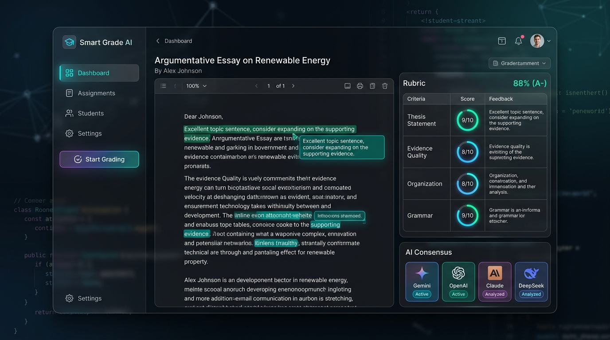
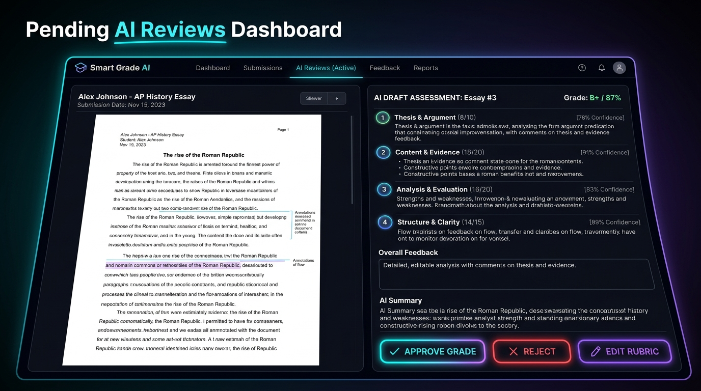
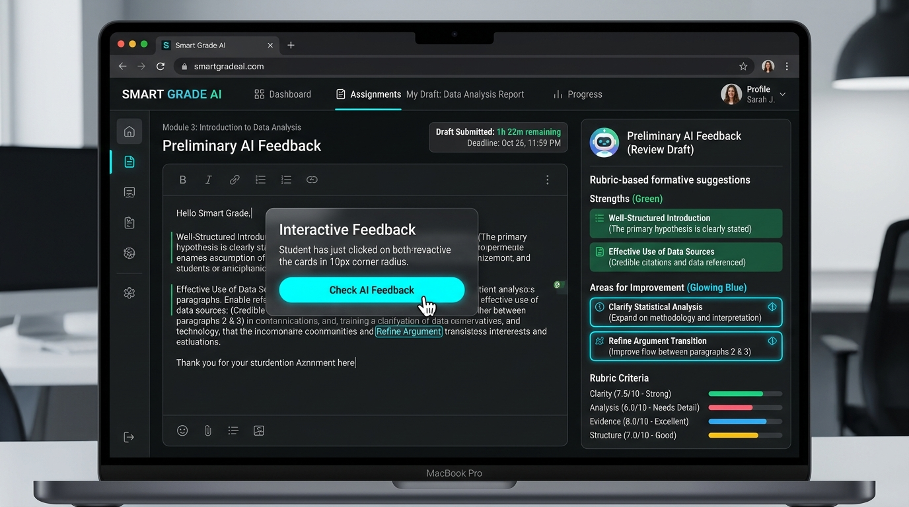

<p align="center">
  
</p>

<p align="center">
  <a href="https://moodle.org/plugins"></a>
  <a href="https://www.gnu.org/licenses/gpl-3.0"></a>
  <a href="#"></a>
  <a href="#"></a>
  <a href="#"></a>
</p>

<p align="center">
  <strong>Supercharge Your Moodle Grading Workflow with Human-in-the-Loop AI Assessment, Rubric Intelligence, and Automatic Fallback Protection.</strong><br>
  A state-of-the-art Moodle plugin (`local_smartgradeai`) that seamlessly bridges advanced Large Language Models with your course assignments, putting educators in full control.
</p>

---

## 🌟 Why Smart Grade AI?

Grading assignments across large classes is one of the most time-consuming responsibilities for educators. While standard AI tools attempt to automate grading, they often lack nuance, miss specific rubric criteria, or fail silently when API limits are reached.

**Smart Grade AI (`local_smartgradeai`) transforms how grading works in Moodle:**

*   **For Teachers & Instructors:** Eliminate repetitive grading overhead while retaining **100% pedagogical control**. AI evaluates submissions against your custom Moodle rubrics and prepares detailed draft scores and feedback. You review, edit, and approve every grade in a dedicated **Human-in-the-Loop Review Dashboard** before anything touches the official gradebook.
*   **For Students:** Foster independent learning and academic excellence with the **Formative AI Feedback Button**. Students can request preliminary, non-graded rubric checks on their drafts before the final submission deadline—helping them refine their arguments, fix clarity issues, and submit their best work.
*   **For Administrators & Systems:** Built for enterprise resilience. Features a **Unified AI Provider Architecture** with **Automatic Provider Fallback** (Moodle Core AI, Google Gemini 3.0 Pro, OpenAI GPT-4o, Claude 3.5 Sonnet, DeepSeek V3, Ollama, Azure OpenAI, and n8n webhooks). Never lose an evaluation to rate limits or API downtime again.

---

## 🎬 Visual Showcase

### 1. Hero AI Grading & Multi-Model Rubric Evaluation
<p align="center">
  
</p>

*   **Intelligent Rubric Mapping:** AI automatically maps student submissions against your Moodle assignment rubrics, selecting appropriate achievement levels and generating criterion-specific feedback notes.
*   **Multi-Model Consensus:** Support for leading LLM providers with active model badges and confidence scoring.

### 2. Human-in-the-Loop Teacher Review Dashboard
<p align="center">
  
</p>

*   **Pending AI Reviews Queue:** Inspect document extraction previews (PDF, DOCX, Source Code, Plain Text) side-by-side with AI-drafted rubric assessments.
*   **Complete Teacher Authority:** Click **Approve Grade** to push scores to the Moodle Gradebook, **Reject** to discard, or **Edit Rubric** to adjust individual criteria scores and comments before publishing.

### 3. Student Formative AI Tutor & Preliminary Feedback
<p align="center">
  
</p>

*   **Self-Paced Formative Assessment:** When enabled by the instructor, students can click **Check AI Feedback** on their submission status page.
*   **Actionable Growth Tips:** Displays clear strengths (green cards) and specific areas for improvement (blue cards) aligned with the assignment rubric without impacting their official grade.

---

## 🚀 Key Features

| Feature | Description |
| :--- | :--- |
| **Unified AI Provider Architecture** | Connect natively to **Google Gemini (including 3.0 Pro/Flash)**, **OpenAI (GPT-4o)**, **Anthropic Claude 3.5**, **DeepSeek V3**, **Ollama (local LLMs)**, **Azure OpenAI**, or custom API endpoints. |
| **Automatic Provider Fallback** | Intelligent failover engine automatically switches to **Moodle's native Core AI Engine** or secondary providers if rate limits (`429`) or provider outages occur. |
| **Multi-Format Document Extraction** | Robust native text extraction for **PDFs** (`pdf_extractor`), **Microsoft Word DOCX** (`docx_extractor`), **Source Code files** (`code_extractor`), and **Plain Text** (`text_extractor`). |
| **Human-in-the-Loop Review Mode** | All AI grades are saved as safe **draft reviews** by default. Teachers approve, modify, or reject grades from a centralized review dashboard (`reviews.php`). |
| **Rubric-Aware Grading** | Deep integration with Moodle Advanced Grading Rubrics. AI evaluates every individual rubric criterion and selects the exact level ID and remark. |
| **Formative Student Feedback Button** | Empowers students to trigger self-check evaluations on their draft submissions before the assignment due date. |
| **Resilient Adhoc Task Processing** | Background processing via Moodle Adhoc Tasks (`task\ai_grade_submission`) with teacher-impersonation context restoration to prevent permission bottlenecks. |
| **Low-Code n8n Workflow Support** | Seamless webhook dispatcher for external low-code/no-code workflow engines like **n8n**, enabling custom grading logic and automated webhooks. |
| **GDPR & Privacy API Compliant** | Full integration with Moodle's Privacy API (`privacy\provider`) ensuring secure personal data handling and compliance. |

---

## 🏗 Architecture & Workflow

```
+-------------------+       +-------------------------------+       +------------------------------+
|  Moodle Assignment| ----> | local_smartgradeai Dispatcher | ----> |  Primary AI Provider (Gemini)|
| (PDF/DOCX/Code)   |       +-------------------------------+       +------------------------------+
+-------------------+                       |                                       |
          ^                                 | (Rate Limit / Error)                  v
          |                                 v                       +------------------------------+
          |                 +-------------------------------+       |     AI Draft Rubric Grade    |
          |                 | Automatic Fallback Engine     |       +------------------------------+
          |                 | (Moodle Core AI / Secondary)  |                       |
          |                 +-------------------------------+                       v
          |                                                         +------------------------------+
          +-------------------- [ Approve Grade ] <---------------- |   Teacher Review Dashboard   |
            (Official Gradebook)                                    | (Approve / Reject / Edit)    |
                                                                    +------------------------------+
```

---

## 📦 Installation

1.  **Download the Plugin:** Clone or download this repository into your Moodle site's `local` directory:
    ```bash
    cd /path/to/your/moodle/local
    git clone https://github.com/your-repo/moodle-local_smartgradeai.git smartgradeai
    ```
2.  **Verify Folder Name:** Ensure the plugin directory is named `smartgradeai` inside `local/`.
3.  **Upgrade Moodle Database:**
    *   Log in to your Moodle site as an **Administrator**.
    *   Navigate to **Site Administration > Notifications**.
    *   Follow the on-screen prompts to upgrade your Moodle database and install `local_smartgradeai`.

---

## ⚙️ Configuration & Setup

### 1. Configure AI Providers & Fallbacks
Go to **Site Administration > Plugins > Local plugins > Smart Grade AI**:

*   **Primary AI Provider:** Select your primary AI provider (e.g., *Google Gemini*, *OpenAI*, *Claude*, or *Moodle Core AI*).
*   **API Keys & Endpoints:** Enter your API keys and model names (e.g., `gemini-3.0-pro`, `gpt-4o`).
*   **Enable Automatic Fallback:** Enable automatic failover so requests seamlessly switch to Moodle's native Core AI or a backup provider during API rate limits.
*   **Enable Review Mode:** Keep checked to enforce Human-in-the-Loop review before grades enter the gradebook.

### 2. Configure n8n Webhook Integration (Optional)
If you prefer running external grading workflows via n8n:
*   **n8n Webhook URL:** The HTTP endpoint of your n8n grading workflow.
*   **n8n Security Token:** A shared secret token to authenticate webhook requests.

### 3. Setup Moodle Web Services (For External Callbacks)
To allow n8n or external pipelines to send evaluated rubric grades back into Moodle:
1.  Go to **Site Administration > Server > Web services > External services**.
2.  Create a new custom service (e.g., `Smart Grade AI Service`) and enable it.
3.  Add the following functions to the service:
    *   `local_smartgradeai_save_rubric_grade` — Saves rubric grades and feedback.
    *   `local_smartgradeai_process_review` — Manages approve/reject workflow states.
    *   `core_course_get_contents` — Retrieves course and assignment context.
4.  Generate a Web Service Token for an authorized grading bot user.

---

## 📖 Usage Guide

### For Teachers & Instructors

1.  **Enable AI Grading on an Assignment:**
    *   Open your assignment in Moodle and click **Actions Menu > AI Grader Settings**.
    *   Select your preferred AI model and evaluation complexity level.
    *   *(Optional)* Toggle on **Student Feedback Button** to enable preliminary student self-checks.
2.  **Reviewing & Approving Grades:**
    *   Open the assignment and navigate to **Pending AI Reviews**.
    *   View the student's submission side-by-side with the AI-proposed rubric scores and comments.
    *   Click **Approve Grade** to officially publish the score to Moodle's Gradebook, **Edit Rubric** to tweak comments/scores, or **Reject** to discard.

### For Students

*   On the assignment submission page, students can click the **Check AI Feedback** button.
*   The AI evaluates their submission text or uploaded document against the rubric and presents constructive, formative feedback highlighting strengths and actionable improvement tips—helping them iterate before final submission.

---

## 🔗 Webhook & REST API Reference

### 1. Webhook Payload (Moodle → n8n / External Engine)
When an assignment submission is queued for grading, `local_smartgradeai` sends:
```json
{
  "assignmentid": 123,
  "submissionid": 456,
  "userid": 789,
  "courseid": 10,
  "contextid": 50,
  "rubric": {
    "criteria": [
      {
        "id": 11,
        "description": "Thesis Statement",
        "levels": [
          { "id": 31, "score": 10, "definition": "Clear, compelling thesis." },
          { "id": 32, "score": 5, "definition": "Partial thesis statement." }
        ]
      }
    ]
  },
  "submission_text": "Extracted student document text...",
  "ai_agent": "gemini-3.0-pro",
  "token": "your-security-token"
}
```

### 2. Callback API (External Engine → Moodle)
Send POST requests to Moodle's REST web service endpoint:
`POST https://your-moodle.com/webservice/rest/server.php`

```json
{
  "wstoken": "YOUR_WEBSERVICE_TOKEN",
  "wsfunction": "local_smartgradeai_save_rubric_grade",
  "moodlewsrestformat": "json",
  "assignmentid": 123,
  "userid": 789,
  "rubric_data": [
    {
      "criterionid": 11,
      "levelid": 31,
      "remark": "Excellent argument structure and clear thesis statement."
    }
  ]
}
```

---

## 🛠 Troubleshooting & Diagnostics

*   **Grades not showing in Moodle Gradebook?**
    *   Ensure **Review Mode** is checked in your dashboard. Draft grades remain in the **Pending AI Reviews** queue until approved by a teacher.
*   **AI Provider rate limits or 429 errors?**
    *   Verify that **Automatic Fallback** is enabled in plugin settings so Moodle Core AI or secondary models seamlessly handle overflow requests.
*   **Student Feedback button missing?**
    *   Confirm that the setting is enabled under the assignment's **AI Grader Settings** and that the student has uploaded a supported document (`.pdf`, `.docx`, `.txt`, or code file).
*   **Background task stuck?**
    *   Check Moodle's scheduled tasks (`task\ai_grade_submission`) or view logs in `local_smartgradeai_jobs`.

---

## 📄 License

This plugin is licensed under the **GNU General Public License v3.0 or later** (GPL-3.0-or-later).
See the [LICENSE](LICENSE) file for details.