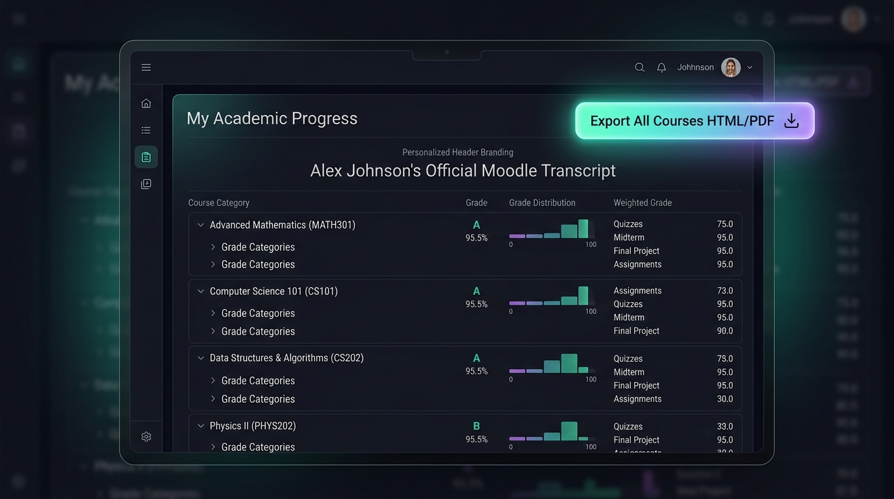
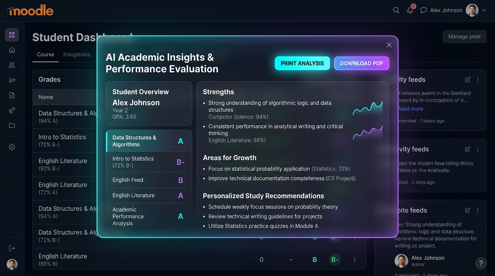

<p align="center">
  
</p>

<p align="center">
  <a href="https://moodle.org/plugins"></a>
  <a href="https://www.gnu.org/licenses/gpl-3.0"></a>
  <a href="#"></a>
  <a href="#"></a>
  <a href="#"></a>
</p>

<p align="center">
  <strong>The All-in-One Multi-Course Student Academic Report & AI Performance Evaluation Plugin for Moodle.</strong><br>
  Export complete transcripts across ALL enrolled courses in a single formatted HTML/Word document, deliver AI-driven academic feedback, and empower parents and mentors with unified grade visibility.
</p>

---

## 🌟 Why Student Course Grades Report?

In native Moodle, viewing and exporting grades requires navigating course by course. For students preparing academic portfolios, parents tracking their child's holistic progress, or advisors reviewing cross-disciplinary performance, fragmented course gradebooks create unnecessary friction.

**Student Course Grades Report (`report_studentgrades`) transforms Moodle grade reporting into an executive academic transcript:**

- 🎒 **For Students:** View and export your entire academic history across **ALL enrolled courses** in a single, beautifully structured HTML, PDF, or MS Word-compatible document. Gain instant clarity on course totals, category weights, and overall GPA.
- 👨‍👩‍👧 **For Parents & Mentors:** Built-in integration with `local_parentportal` allows linked parents, guardians, and academic advisors to seamlessly switch between mentees and evaluate complete multi-course academic records from a single unified dashboard.
- 🤖 **For Interactive AI Mentorship:** Leverage dual-mode **AI Performance Analysis** powered by Moodle Core AI (`\core_ai\manager`) or asynchronous email webhooks (e.g., n8n). Provide students with constructive, rubric-aware academic insights, highlight strengths, identify areas for growth, and print or download AI evaluation reports instantly.
- 🏫 **For Institution Administrators:** Enjoy full visual control with **18+ customizable color settings**, custom header branding, site logo integration, full Right-To-Left (RTL) language support, and built-in rate-limiting cooldowns to protect AI API quotas.

---

## 🎬 Visual Showcase

### 1. Consolidated Multi-Course Transcript & Export
<p align="center">
  
</p>

- **Holistic Academic Overview:** Combines every active and completed course enrollment into a single hierarchical grade structure.
- **One-Click Universal Export:** Easily export all course grades as a single standalone HTML file formatted for printing, PDF conversion, or MS Word editing.
- **Custom Header Branding:** Personalize student transcript headers with institutional logos and custom titles.

### 2. AI-Powered Academic Performance Analysis Modal
<p align="center">
  
</p>

- **Real-Time AI Academic Feedback:** Evaluates grades across all courses using Moodle Core AI to deliver personalized strengths, areas for improvement, and study recommendations.
- **Print & PDF Exportable AI Reports:** Dedicated on-screen action buttons allow students and advisors to download or print AI evaluations for advising sessions.
- **Rate-Limiting & API Protection:** Custom cooldown timers prevent token abuse while maintaining smooth student interaction.

### 3. Parent Portal & Mentor Multi-Student Executive View
<p align="center">
  
</p>

- **Seamless Mentee Switching:** Linked parents and advisors can quickly switch between assigned students without navigating away from the dashboard.
- **Executive Summaries & Progress Tracking:** Instantly inspect GPA trends, credits earned, category averages, and request AI Mentee Progress Reports.

---

## ✨ Key Features

| Feature | Description |
| :--- | :--- |
| 📑 **Single-File Multi-Course Export** | Export all course grades for a student as one combined HTML file ready for Word, PDF, or archives. |
| 🌳 **Hierarchical Grade Tree** | Clear academic structure displaying course names, grade categories, activities, and course totals. |
| 🎨 **18+ Custom Color Settings** | Configure header colors, row styling, badge tints, and background themes from Site Administration. |
| 🖼️ **Institutional Brand Integration** | Automatically embeds the site logo and custom institution headers in exported reports. |
| 🤖 **Dual-Mode AI Performance Analysis** | Instant on-screen Core AI modal analysis & asynchronous webhook (n8n) email reporting. |
| 📄 **Exportable AI Evaluations** | Dedicated **Print Analysis** and **Download PDF** buttons for on-screen AI feedback. |
| 👨‍👩‍👧 **Parent & Mentor Portal Integration** | Direct support for linked parent-student relationships via `local_parentportal`. |
| 🌍 **Full RTL & Multilingual Support** | Complete bidirectional layout support for Arabic, Hebrew, and other Right-To-Left languages. |
| ⏱️ **AI Cooldown & Rate Limiting** | Adjustable user cooldown in minutes to regulate AI requests and prevent API exhaustion. |
| 🔒 **GDPR & Privacy Compliant** | Strictly read-only aggregation of Moodle core grade data without persistent caching or external storage. |

---

## 🎯 Target Use Cases

- **🎓 Scholarship & Graduate Applications:** Students can generate a unified academic transcript across all semesters in seconds.
- **👩‍🏫 Academic Advising Sessions:** Advisors get an immediate cross-disciplinary diagnosis of student performance without opening multiple tabs.
- **👨‍👩‍👧 Parent Engagement:** Parents view complete child grade profiles and AI-generated study recommendations.
- **🏫 End-of-Term Administrative Audits:** Quickly generate standardized cross-course performance records for accreditation or review.

---

## 🤖 AI-Powered Performance Analysis Deep-Dive

The plugin includes an advanced AI academic feedback engine designed to motivate students and assist advisors:

### 1. Instant On-Screen Analysis (Moodle Core AI)
- Uses Moodle 4.5+'s native AI subsystem (`\core_ai\manager`) to analyze consolidated grades.
- Renders an interactive glassmorphism modal with custom loading indicators and structured markdown feedback.
- Includes built-in **Print** and **Download as PDF** controls directly inside the analysis modal.
- Automatic fallback mode ensures compatibility on older Moodle environments.

### 2. Email-Based Webhook Analysis (n8n & External Automation)
- Sends structured, JSON-formatted multi-course grade data (courses, categories, grades, and weights) to an external webhook endpoint.
- Perfect for automated n8n workflows that process grades via LLMs (Gemini, GPT-4o, Claude) and email personalized progress reports directly to students or parents.
- Authenticated via secure Bearer tokens and custom HTTP headers (`Authorization`, `X-N8N-Chat-Token`).

### 3. Customizable Cooldown Protection
- Administrators can configure a cooldown window (in minutes) via settings to control request frequency per user.
- Utilizes Moodle user preferences (`report_studentgrades_last_ai_request`) to enforce rate limits transparently.

---

## ⚙️ Installation & Configuration

### 1. Plugin Installation
1. Download the plugin ZIP file or clone the repository into your Moodle installation:
   ```bash
   git clone https://github.com/Smartlearn-edu/moodle_report_studentgrades.git report/studentgrades
   ```
2. Log in to your Moodle Site Administration panel and navigate to **Notifications** to install the database schema.

### 2. Admin Settings Configuration
Navigate to **Site Administration > Plugins > Reports > Student Course Grades** (`/admin/settings.php?section=report_studentgrades`):
- **Color & Styling Palette:** Customize primary colors, header styles, table borders, and text contrasts.
- **AI Performance Settings:** Enable AI buttons, enter your webhook URL and Bearer token, configure AI prompt templates, and set cooldown durations.

---

## 🔐 Permissions & Capabilities

| Capability | Purpose | Allowed Default Roles |
| :--- | :--- | :--- |
| `report/studentgrades:view` | View own consolidated course grades report | Students, Teachers, Editing Teachers, Managers |
| `report/studentgrades:viewall` | View any user's consolidated course grades report | Teachers, Editing Teachers, Managers, Parents (`local_parentportal`) |

---

## 🚀 Access & Navigation Guide

### For Students
- Navigate to **User Menu > Profile > Reports > Student Course Grades**.
- Or access directly via URL: `/report/studentgrades/index.php`.

### For Parents & Mentors
- When linked via `local_parentportal`, select the mentee from the dashboard and open **Student Course Grades** to inspect all enrolled courses for that child.

### For Teachers & Administrators
- Visit any student profile in Moodle and click the **Student Course Grades** report tab in the administration block.

---

## 🏗️ Plugin Architecture & Comparison

> [!NOTE]
> This is a **user-context level report plugin** (`report_studentgrades`). It complements Moodle's native course-level reports by providing a cross-course aggregation layer.

```
       Moodle Native Grade Report              Student Course Grades Report
       (One Course → All Students)              (One Student → All Courses)
       
            [ Math 301 ]                                [ Student Profile ]
           /   |    \     \                               /       |       \
          /    |     \     \                             /        |        \
    Student1 Student2 Student3                     [ Math 301 ] [ CS 101 ] [ Physics II ]
```

---

## 📋 Release Notes & Changelog

### Version 1.1.2 *(Current Release)*
- **AI Academic Performance Analysis:** Added native Moodle Core AI subsystem modal integration with Print & PDF download buttons.
- **Asynchronous Webhook Automation:** Integrated JSON payload webhook dispatching for external n8n email report workflows.
- **Parent & Mentor Portal Integration:** Added multi-mentee grade inspection compatibility for `local_parentportal`.
- **API Cooldown Engine:** Implemented user-configurable rate-limiting timers to prevent AI API overload.
- **Visual & UI Enhancements:** Upgraded modern dark mode aesthetics, responsive table layouts, and RTL Arabic rendering.

### Version 1.0.0
- Initial release featuring multi-course consolidated grade reporting.
- 18+ admin-configurable color and branding options.
- Standalone HTML/Word export and overall enrollment summary metrics.
- GDPR privacy compliance and RTL language support.

---

## 🛡️ Privacy & GDPR Compliance

> [!IMPORTANT]
> This plugin **does not store or replicate** personal student grade data. It operates as an on-demand reporting interface reading directly from Moodle's core grade database tables. All exported HTML/PDF reports are generated dynamically in-memory and are never cached or stored on the server.

---

## 🤝 Support, License & Credits

- **Author & Maintainer:** Mohammad Nabil (`mohammad@smartlearn.education`)
- **Organization:** Smartlearn Education
- **Bug Reports & Feature Requests:** Please visit the project GitHub repository or Moodle Plugins Directory page.

<div align="center">
  Licensed under the <a href="http://www.gnu.org/copyleft/gpl.html">GNU General Public License v3 or later</a>.<br>
  © 2026 Smartlearn Education. All rights reserved.
</div>
